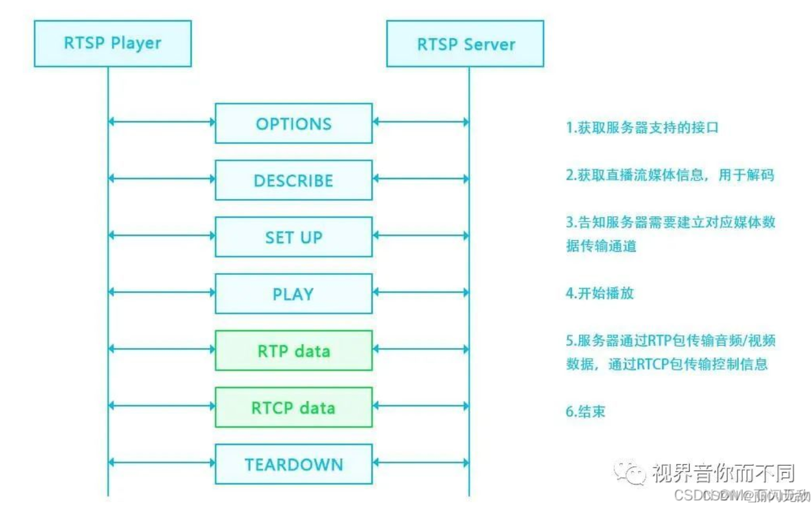
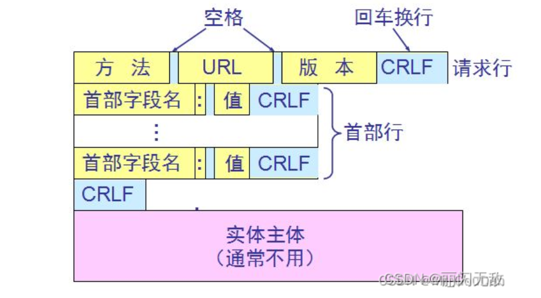
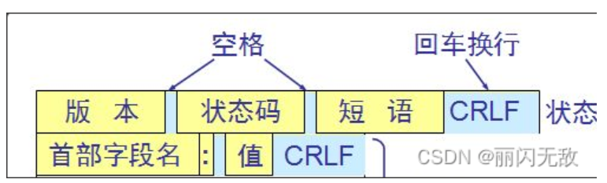

# FFmpeg

> Author: Sylvie233
>
> Date: 23/5/12
>
> Point: 


[TOC]

## 基础介绍

### ffmpeg

```
ffmpeg:
	-V
	-ac:
	-acodec:
	-an:
	-ar:
	-bsf:
		:v:
			h264_mp4toannexb:
	-c:
		:a: copy
		:v:
			copy
	-codecs: 查看当前支持的编码器
	-f: 格式
		flv:
		gdigrab
	-filters: 查看当前支持的滤镜
	-formats: 查看当前支持的封装格式
	-g:
	-h:
		decoder:
		waccels:
	-i: 输入
		desktop:
	-keyint_min: 关键帧间隔
	-list_devices:
	-list_options:
	-pix_fmt: 帧格式
	-preset:
	-r: 帧数
	-re:
	-rtsp_transport:
	-s: 分辨率
	-sc_threshold: 禁用场景识别，即禁止自动添加IDR帧
	-t:
	-vcodec: 视频编码格式
	-vf: 合成视频的分辨率自适应
	-vn:

ffplay:
	-f:
	-i: 输入
	-stats:
	


ffprobe:


```


### PCM

脉码编码调制


### YUV


### HLS协议


### HTTP-FLV协议


### RTSP协议

实时流传输协议

- RTSP：负责服务器与客户端之间的请求和响应
- RTP：负责服务器与客户端之间传输媒体数据
- RTCP：负责提供有关RTP传输质量的反馈，确保RTP传输的质量


```
Real Time Streaming Protocol:
	Request: Method URL
	Response: Status
	Transport:
	Range:
	CSeq:
	User-Agent:
	Session:
```


rtp传输端口、rtcp传输端口


RTSP传输层要求基于tcp



请求报文



响应报文




#### SDP协议

会话描述协议

多个媒体级描述、一个会话级描述

```
Session Description Protocol:
	Session Description Protocol Version:
	Owner/Creater, Session Id(o):
	Time Description, active time(t):
	Session Attribute(a):
	Media Description, name and address(m):
	Media Attribute(a):
```


### RTMP协议

实时消息传输协议


## 核心内容


