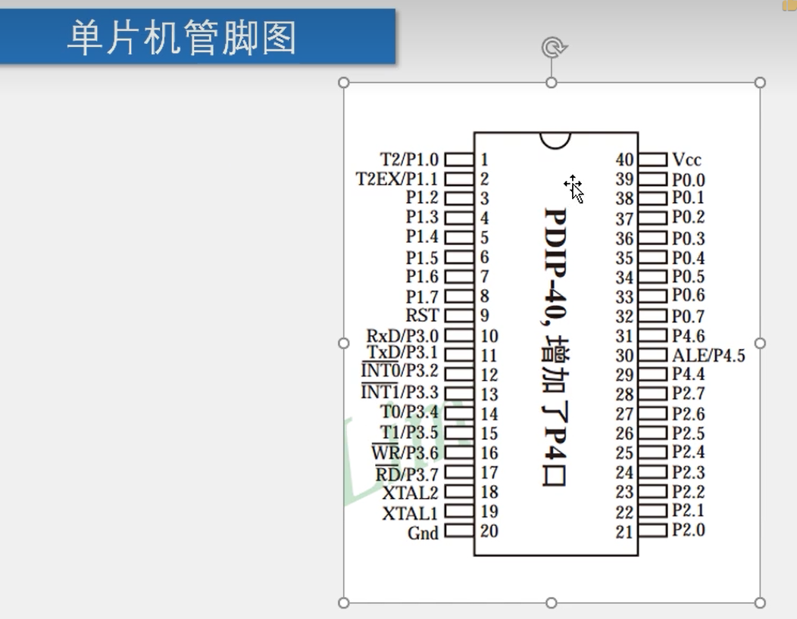
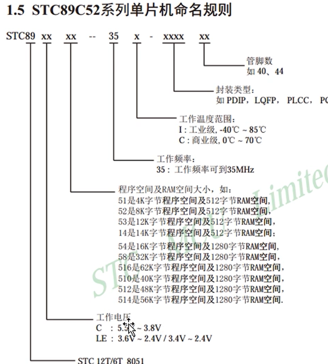
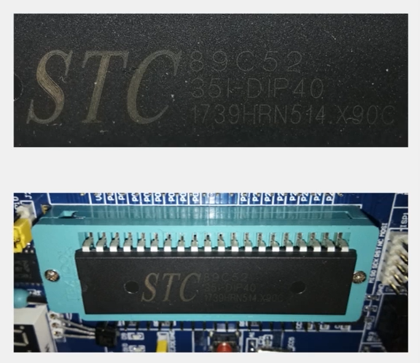
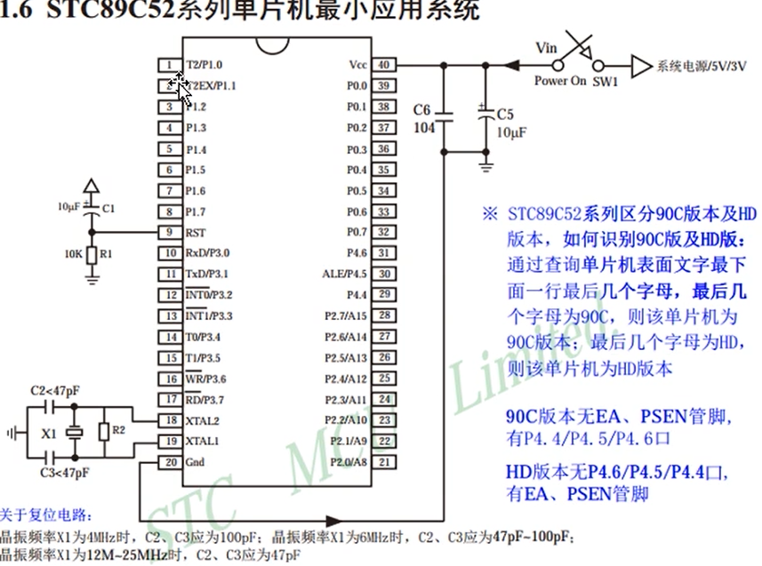
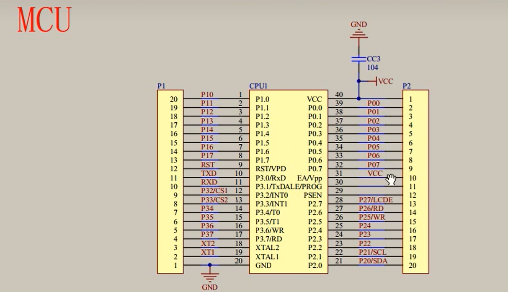
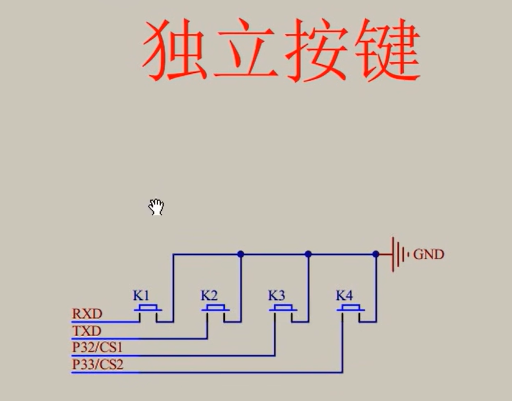
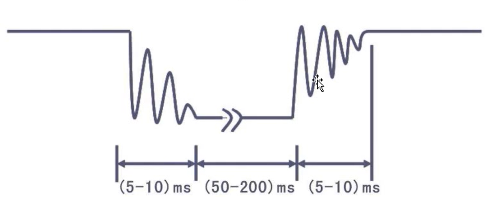
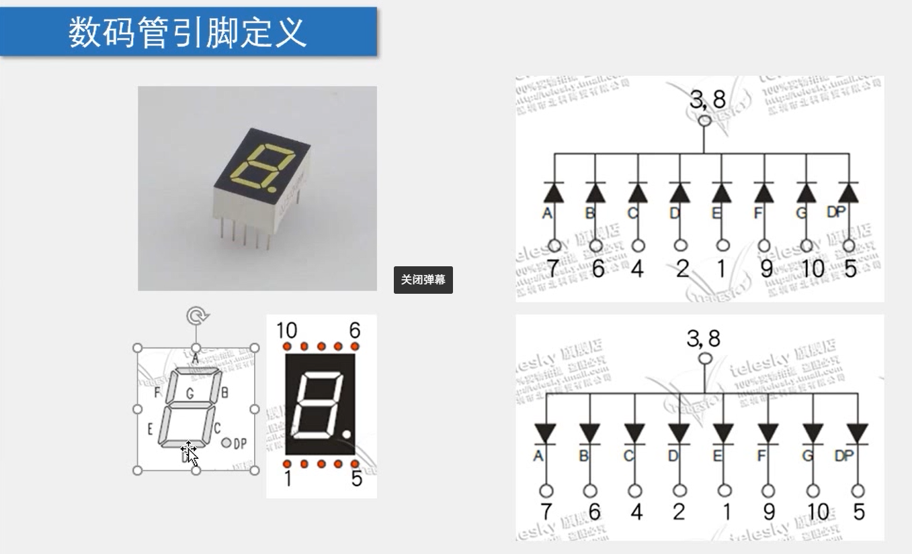
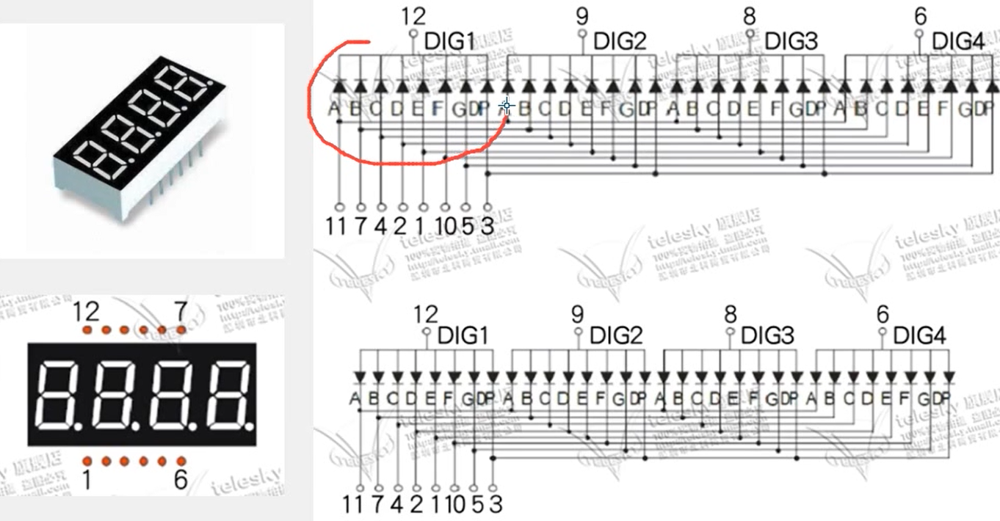

# 单片机

> Author: Sylvie233
>
> Date: 23/5/22
>
> Point: P15

[TOC]

## 基础介绍

51单片机、STM32单片机、RTOS、ARM+Linux


### 单片机

#### 管脚




### Keil5


### STC-ISP

程序安装到硬件上`.hex`（编译生成二进制文件）


### STC89C52单片机









## 核心内容

### C语言

```
<REG52.H>

<REGX52.H> // 包含一些宏定义
	P2:
    P2_0:
    P3_1:
	
<INTRINS.H>
	_nop_():
```


### LCD1602

液晶显示屏

调试显示工具


### MCU




#### 独立按键




按键抖动




### LED

数码管



共阳极、共阴极连接





138译码器（二进制与十进制转换）


