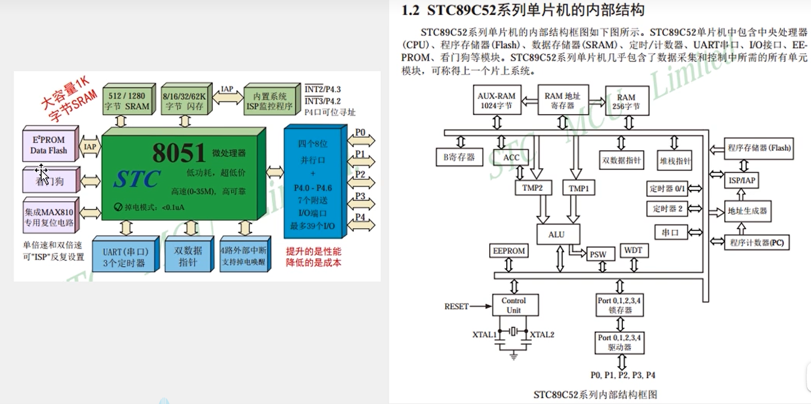

# 单片机

> Author: Sylvie233
>
> Date: 23/5/22
>
> Point: P15

[TOC]

## 基础介绍

51单片机、STM32单片机、RTOS、ARM+Linux


### 单片机

#### 管脚


### Keil5


### STC-ISP

程序安装到硬件上`.hex`（编译生成二进制文件）


### STC89C52单片机





## 核心内容

### C语言

```
<REG52.H>

<REGX52.H> // 包含一些宏定义
	P2:
    P2_0:
    P3_1:
	
<INTRINS.H>
	_nop_():
```


### LCD1602

液晶显示屏

调试显示工具


### MCU


#### 独立按键


按键抖动


### LED

数码管


共阳极、共阴极连接


138译码器（二进制与十进制转换）


