# ARM

> Author: Sylive233
>
> Date: 23/7/15
>
> Point:
>
> ​	正点原子(第二期) Linux 裸机开发 P20
>
> ​	正点原子(第三期) Linux 系统移植 P23
>
> ​	正点原子(第四期) Linux 驱动开发 P37


## 基础介绍


## 核心内容

### ARM

```
:
	
```


### UBoot

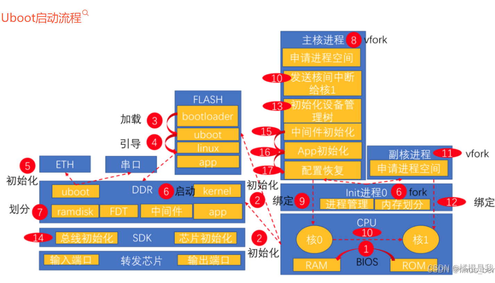

运行在ROM上的BL0阶段：上电后CPU会直接从IROM上开始执行引导程序，初始化flash和SRAM，然后将flash中的uboot-spl镜像文件加载到SRAM。

运行在SRAM上的BL1阶段：初始化外部 DDR，从flash中将完整的uboot装载到外部DDR中，sp跳转到 DDR 中的 u-boot 其实地址执行

运行在外部DDR上的BL2阶段：根据链接文件u-boot.lds，找到入口_start，先进行arch级初始化，会和spl阶段有重复的部分，然后到_main函数进行板级初始化，重定向前的区域规划，uboot将自己拷贝到 DRAM 最后面的内存区域中，为内核腾出空间，然后继续板级初始化各种还没初始化完的设备，然后命令行状态


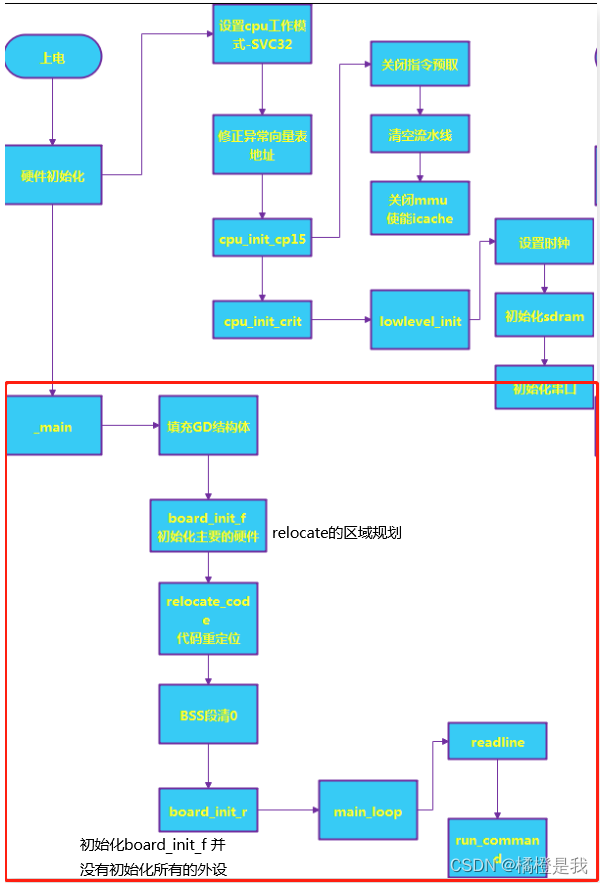


启动流程

1. 使用烧写工具烧写uboot至SD卡。
2. 开发板上电，运行uboot。
3. 倒计时开始，按下任意键进入uboot命令行。
4. 设置环境变量bootcmd为从tftp网络服务下载内核镜像zImage及设备树文件等；通过bootz命令启动。
5. 系统运行

```
函数:
	cpu_init_cp15：
	cpu_init_cirt函数：
        reset函数：将处理器模式设置为SVC模式，关闭FIQ和IRQ，设置中断向量，初始化CP15，
        lowlevel_init函数：设置sp指针，R9寄存器
        s_init函数：空函数
    _main函数：
    	board_init_f函数：
    relocate_code函数：

启动流程：
	1.arch级初始化
		- 指定uboot的入口，在链接脚本uboot.lds中指定uboot的入口为start.S中的_start
		- 关中断（FIQ和IRQ）设置CPU进入SVC32模式
		- 重定向异常向量表，目的是将uboot加载到DDR上去
		- 设置CP15寄存器、关闭Cache、MMU等
		- 设置6ULL的内部RAM，在内存中预留出248B的gd,将SP地址保存在R9寄存器中
		- 调用_main函数，进入板级初始化
	2.板级初始化
		- 预留出早期的malloc和gd（global_data）内存区域
		- 初始化gd，即清零处理
		- 初始化DDR、串口、定时器等一系列外设，初始化gd的各个成员变量，uboot会将自己重定位到DDR最后面的区域，给kernel流出空间
		- 拷贝uboot代码至重定向后地址的内存
		- 重定向中断向量表
		- 初始化C语言的运行环境
		- 初始化外设
		- 倒计时3秒，结束之前按下任意键进入uboot命令行，使用boot命令启动Linux内核；倒计时结束未进入命令行，uboot自动启动Linux内核
		

```


```
Uboot启动流程：
u-boot.lds
   |
   |--->_start  <arch/arm/lib/vectors.S>
	       |--->reset  <arch/arm/cpu/armv7/start.S>
	       |       |--->save_boot_params   <arch/arm/cpu/armv7/start.S>
	       |                      |--->save_boot_params_ret    <arch/arm/cpu/armv7/start.S>
	       |                                   |               // 禁止中断(FIQ和IRQ)，设置cpu的模式为SVC模式
	       |                                   |               // 清楚SCTLR的bit13，允许向量重定位，同时
	                                           |               // 重定位向量表，把CP15的c12（VBAR）寄存器设置为
	                                           |               // 0x87800000(uboot的起始地址，也是向量表的起始地址)
	                                           |
	                                           |--->cpu_init_cp15      <arch/arm/cpu/armv7/start.S>
	                                           |                       // 设置cp15相关内容，比如关闭mmu，cache
	                                           |
	                                           |--->cpu_init_crit      <arch/arm/cpu/armv7/start.S>
	                                           |           |
	                                           |           |--->lowlevel_init  <arch/arm/cpu/armv7/lowlevel_init.S>
	                                           |           |                   // 设置栈指针sp = 0x0091FF00,属于MX6ULL
	                                           |           |                   // 的内部ram，同时(sp - GD_SIZE(248))-->sp
	                                           |           |                   // 留出global_data数据结构的位置sp = 0x0091FE08
	                                           |           |                   // 设置sp-->r9, sp==r9
	                                           |           |
	                                           |           |--->s_init     <arch/arm/cpu/armv7/mx6/soc.c>
	                                           |           |               // 空函数，直接返回
	                                           |
	                                           |--->_main      <arch/arm/lib/crt0.S>
	                                                   |       // 设置sp为0x0091ff00,调用函数
	                                                   |       // board_init_f_alloc_reserve(arg:0x0091FF00)后，把sp设为
	                                                   |       // 此函数的返回值：0x0091FA00, r9(gd)设为0x0091FA00;
	                                                   |       // 调用board_init_f_init_reserve(arg:0x0091FA00)后
	                                                   |       // 把gb的成员malloc_base设为0x0091FB00(early_malloc的起始地址)
	                                                   |       // 调用board_init_f函数：会初始化gd，返回之后重新设置环境（sp和gd）
	                                                   |       // 把gd的成员start_addr(0x9EF44E90)赋值给sp, 此时sp == 0x9EF44E90
	                                                   |       // 是外部DDR的地址，gd->bd赋给r9(gd),新的gd结构在bd结构下面，
	                                                   |       // 重新设置gd = r9 - sizeof(*gd); lr = here. gd指向新的区域(DDR内)时
	                                                   |       // lr = here + 68,这是为什么？uboot的拷贝目的地址：0x9FF47000
	                                                   |--->board_init_f_alloc_reserve(arg:0x0091FF)    <common/init/board_init.c>
	                                                   |                       // 在包含此函数的文件中有：DECLARE_GLOBAL_DATA_PTR;
	                                                   |                       // 是个宏定义：#define  DECLARE_GLOBAL_DATA_PTR \
	                                                   |                       //                 register volatile gd_t *gd asm("r9")
	                                                   |                       // 此函数设置留出早期malloc和global_data内存区域，
	                                                   |                       // 返回值：0x0091FA00
	                                                   |
	                                                   |--->board_init_f_init_reserve(arg:0x0091FA00)     <common/init/board_init.c>
	                                                   |                       // 此函数用于初始化gd所指向的结构（清零处理）
	                                                   |                       // 设置gd的成员malloc_base为0x91FB00
	                                                   |                       // 就是early_malloc的起始地
	                                                   |
	                                                   |--->board_init_f       <common/board_f.c>
	                                                   |                       // 主要做两个工作：初始化一系列外设（串口、定时器等）
	                                                   |                       // 初始化gd的各个成员变量(此时gd还保存在内部ocram中)。上面的工作都是通过在函数内运行
	                                                   |                       // initcall_sequence_f函数表中的一些函数来实现的，此函数表与
	                                                   |                       // board_init_f函数定义在相同的文件，是static属性的静态表
	                                                   |                       // 表中的函数执行完后会把gd->mon_len设为0xA8E74(__bss_end-_start),
	                                                   |                       // 也就是代码长度。gd->malloc_init设为0x400(malloc内存池的大小)
	                                                   |                       // gd->ram_size:0x20000000  gd->ram_top:0xA0000000  gd->relocaddr:0x9FF47000
	                                                   |                       // gd->arch.tlb_size:0x4000  gd->arch.tlb_addr:0x9FFF0000
	                                                   |
	                                                   |--->relocate_code(arg:0x9FF47000)      <arch/arm/lib/relocate.S>
	                                                   |                       // 代码拷贝。0x9FF47000是uboot拷贝目标首地址，offset=0x9FF47000-0x8780000,offset:0x18747000
	                                                   |                       // 拷贝源地址：__image_copy_start=0x87800000,结束地址：__image_copy_end =0x8785dd54
	                                                   |                       // 裸机程序运行需要链接地址与运行地址相同，uboot解决拷贝后的重定位问题是采用ld链接器
	                                                   |                       // 链接时使用选项'-pie'生成位置无关的可执行文件，使用此选项时会生成一个.rel.dyn段，
	                                                   |                       // uboot就是靠这个.rel.dyn来解决重定位问题的（.rel.dyn 段是存放.text 段中需要重定位地址的集合）
	                                                   |                       // 修改.rel.dyn中的label来重定位
	                                                   |
	                                                   |--->relocate_vectors       <arch/arm/lib/relocate.S>
	                                                   |                       // 重定位向量表，将CP15的VBAR寄存器的值设为0x9FF47000，uboot拷贝后的目标首地址
	                                                   |
	                                                   |--->c_runtime_cpu_setup      <arch/arm/cpu/armv7/start.S>
	                                                   |
	                                                   |--->board_init_r       <common/board_r.c>
	                                                   |           |           // 初始化一些在board_init_f函数中未初始化的一些外设，做些后续工作。
	                                                   |           |           // 是通过运行init_sequence_r函数集合中的函数来实现的，init_sequence_r与board_init_f函数
	                                                   |           |           // 在同一个文件。在函数集合中initr_reloc_global_data函数初始化重定位后的gd的一些成员变量
	                                                   |           |           // 集合中的其他函数：初始化了malloc、串口、电源芯片、emmc、环境变量、LCD、初始化跳转表、中断，使能中断
	                                                   |           |           // 初始化网络地址（获取MAC地址，通过读取环境变量ethaddr的值，环境变量保存在emmc中）、
	                                                   |           |           // 初始化网络设备，最后执行run_main_loop函数，主循环（处理命令）
	                                                   |           |
	                                                   |           |--->run_main_loop      <common/board_r.c>
	                                                                       |            // uboot启动以后会进入3秒倒计时，如果在3秒倒计时结束之前按下按下回车键，那么就
	                                                                       |            // 会进入uboot的命令模式，如果倒计时结束以后都没有按下回车键，那么就会自动启动Linux内
	                                                                       |            // 核，这个功能就是由run_main_loop函数来完成的.
	                                                                       |
	                                                                       |--->main_loop(void)    <common/main.c>
	                                                                       |           |        // 如果如果倒计时结束之前按下按键，那么就会执行cli_loop函数，这个就是
	                                                                       |           |        // 命令处理函数，负责接收好处理输入的命令。
	                                                                       |           |
	                                                                       |           |--->bootstage_mark_name
	                                                                       |           |                    // 打印处启动进度
	                                                                                   |
	                                                                                   |--->autoboot_command
	                                                                                   |		|			// 此函数就是检查倒计时是否结束？倒计时结束之前有没有被打断？如果没有被打断则调用函数run_command_list
	                                                                                   |		|--->run_command_list
	                                                                                   |		|			|		// 执行环境变量bootcmd中保存的启动linux指令							
	                                                                                   |
	                                                                                   |--->cli_loop       <common/cli.c>
	                                                                                   |       |     // cli_loop函数是uboot的命令行处理函数，我们在uboot中输入
	                                                                                   |       |     // 各种命令，进行各种操作就是由cli_loop来处理的
	                                                                                   |       |
	                                                                                   |       |--->parse_file_outer
	                                                                                                       |
	                                                                                                       |--->setup_file_in_str
	                                                                                                       |
	                                                                                                       |--->parse_stream_outer
	                                                                                                       |                   // 这个函数就是 hush shell 的命令解释器，负责接收命令行输入，解析并执行。
	                                                                                                       |                   // 负责接收命令行输入，然后解析并执行相应的命令

```


uboot启动linux内核

```
:
	1. 将Linux内核镜像、设备树文件搬进DDR中
		uboot在main_loop()函数中读取环境变量bootcmd的值（该变量的值为几个uboot命令），uboot通过执行这些命令加载Linux镜像、设备树文件至DDR，并启动Linux内核。
	2. 校验内核格式、CRC
	3. 准备传参；
	4. 跳转执行内核。
	
命令bootz:
run_command_list/parse_stream_outer函数
			|		
			|-->bootz命令
			|		|		
			|		|-->do_bootz	<cmd/bootz.c>
			|		|		|
			|		|		|-->bootz_start		<cmd/bootz.c>
			|		|		|		|
			|		|		|		|-->do_bootm_states		<common/bootm.c>
			|		|		|		|		|		//根据BOOT状态执行不同的boot阶段
			|		|		|		|		|-->bootm_start		<common/bootm.c>
			|		|		|		|		|		|		//BOOT状态：BOOTM_STATE_START
			|		|		|		|		|		|		//1.清空image结构体
			|		|		|		|		|		|		//2.获取uboot的环境变量verify的值并赋给image结构体的verify成员
			|		|		|		|		|		|-->bootstage_mark_name
			|		|		|		|		|		|		|		//记录启动阶段的名字
			|		|		|		|-->images->ep=load_addr
			|		|		|		|		|		//获取Linux镜像（zImage）,保存在images的成员变量ep中
			|		|		|		|-->bootz_setup		<cmd/bootz.c>
			|		|		|		|		|		
			|		|		|		|		|-->zi->zi_magic = LINUX_ARM_ZIMAGE_MAGIC
			|		|		|		|		|		|		//根据幻数判断zImage是否正确
			|		|		|		|-->bootm_find_images		<common/bootm.c>
			|		|		|		|		|		
			|		|		|		|		|-->boot_get_ramdisk		<>
			|		|		|		|		|		//查找ramdisk(虚拟磁盘)
			|		|		|		|		|-->boot_get_fdt		<>
			|		|		|		|		|		//查找设备树，将其首地址保存在全局变量images的成员变量ft_addr中，长度保存在ft_len中
			|		|		|		|		|-->set_working_fdt_addr		<>
			|		|		|		|		|		//设置设备树的工作地址
			|		|		|
			|		|		|-->bootm_disable_interrupts	<common/bootm.c>
			|		|		|		|		//关闭中断
			|		|		|-->do_bootm_states		<common/bootm.c>
			|		|		|		|		//根据BOOT状态执行不同的boot阶段
			|		|		|		|		//BOOT状态：BOOTM_STATE_OS_PREP、BOOTM_STATE_OS_FAKE_GO、BOOTM_STATE_OS_GO
			|		|		|		|-->bootm_os_get_boot_func		<common/bootm_os.c>	
			|		|		|		|		|		//查找Linux内核启动函数do_bootm_linux，赋值给函数boot_fn
			|		|		|		|		|		//BOOT状态：BOOTM_STATE_RAMDISK
			|		|		|		|-->...
			|		|		|		|-->boot_selected_os		<common/bootm_os.c>
			|		|		|		|		|		//BOOT状态：BOOTM_STATE_OS_GO
			|		|		|		|		|-->boot_fn
			|		|		|		|		|		|
			|		|		|		|		|		|-->do_bootm_linux		<arch/arm/lib/bootm.c>
			|		|		|		|		|		|		|
			|		|		|		|		|		|		|-->boot_prep_linux		<arch/arm/lib/bootm.c>
			|		|		|		|		|		|		|		|		//启动Linux之前做一些其他处理， 比如在设备树的chosen节点下添加子节点bootargs，bootargs子节点存放bootargs环境变量
			|		|		|		|		|		|		|-->boot_jump_linux		<arch/arm/lib/bootm.c>
			|		|		|		|		|		|		|		|		//machid = gd->bd->bi_arch_number;获取机器ID并保存在变量machid中，Linux内核会判断是否支持这个机器
			|		|		|		|		|		|		|		|		//kernel_entry=(void (*)(int, int, uint))images->ep;获取kernel_entry函数，该函数不是在uboot中定义的，
			|		|		|		|		|		|		|		|		//而是在Linux内核定义的，而Linux镜像的第一行代码就是kernel_entry函数，所以images->ep所保存的Linux镜像首地址就是函数kernel_entry的地址
			|		|		|		|		|		|		|		|-->announce_and_cleanup		<arch/arm/lib/bootm.c>
			|		|		|		|		|		|		|		|		|		//输出"Starting kernel"并做一些清理工作	
			|		|		|		|		|		|		|		|-->kernel_entry
			|		|		|		|		|		|		|		|		|		//进入内核函数，最终的大Boss，启动内核！！
```

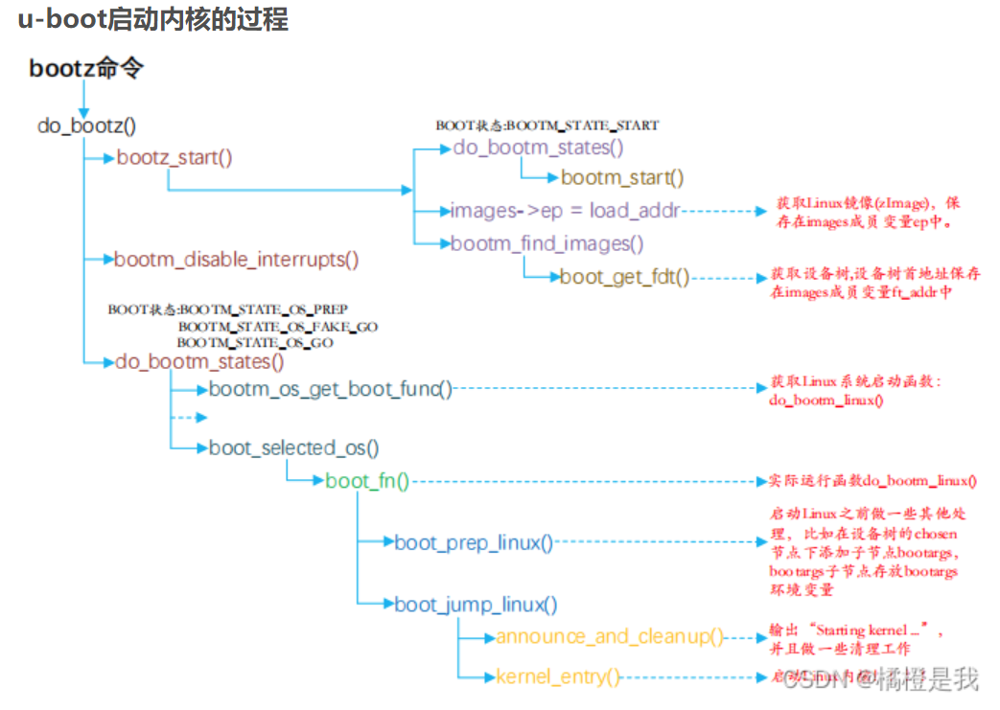


### Linux

内核启动流程

在 linux内核启动前， bootloader会将存储介质中的 initrd 文件加载到内存，内核启动时会在访问真正的根文件系统前先访问该内存中的 initrd 文件系统。在 bootloader 配置了 initrd 的情况下，内核启动被分成了两个阶段，第一阶段先执行 initrd 文件系统中的"某个文件"，完成加载驱动模块等任务，第二阶段才会执行真正的根文件系统中的 /sbin/init 进程


head.S

- **使能SVG模式**
- **关闭所有中断**
- **校验 atags 或设备树(dtb)的合法性**
- **使能MMU**

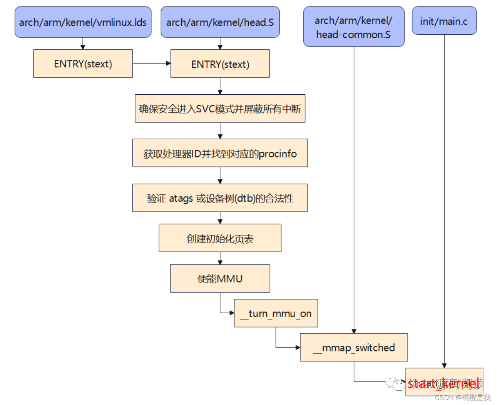


#### start_kernel

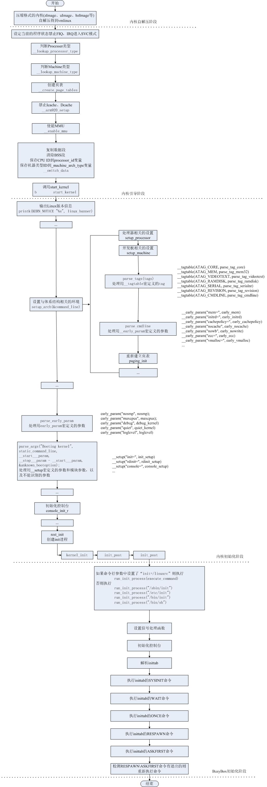


**Init/main.c**

**setup_arch()**

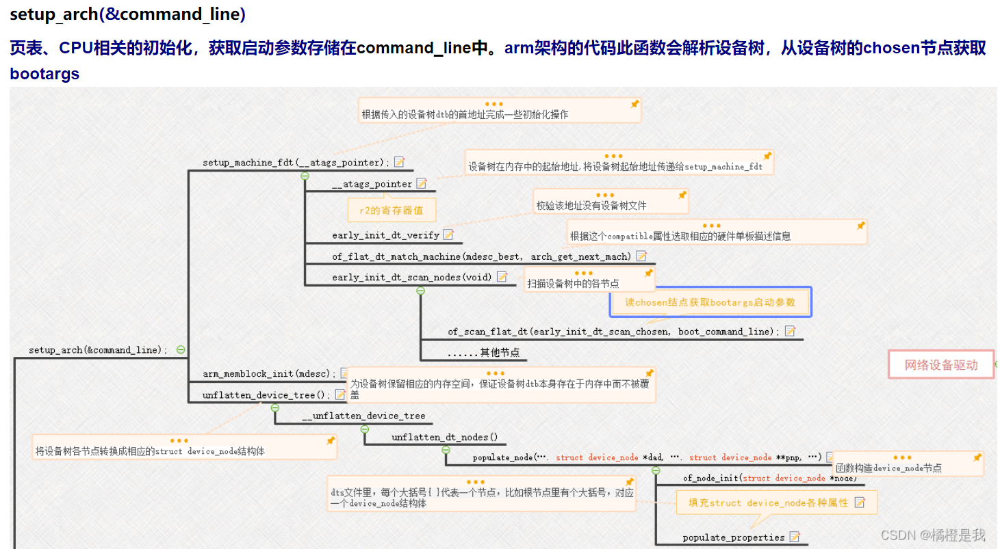


**mm_init()**

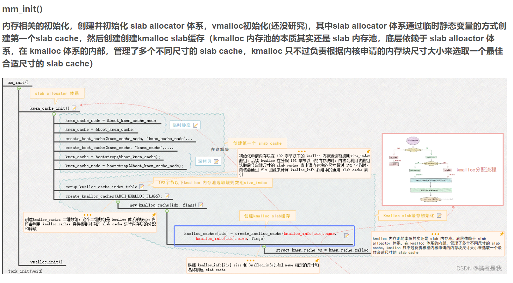


**fork_init()**

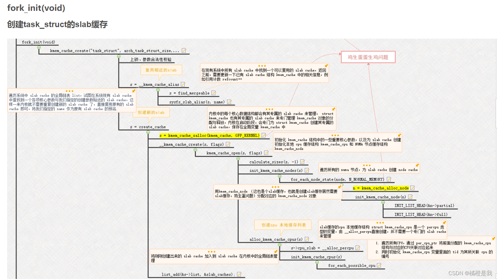


**reset_init()**

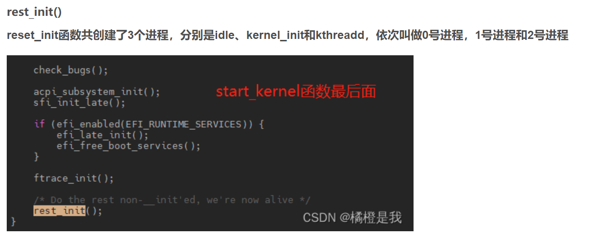

**kernel_init主要任务是完成设备驱动初始化和挂载根文件系统，并读取根文件系统中init程序，将从内核态转变到用户态。**


**2号进程kthreadd**
**内核线程的守护进程，始终运行在内核态，负责所有内核线程的创建。原理是不断循环kthread_create_list全局链表，如果为空，则调度出去；否则则调用create_kthread接口来创建内核线程。**

**kthread_create_list全局链表的添加是调用kthread_create->kthread_create_on_node->__kthread_create_on_node()实现的，所以说，所有的内核线程都是间接以kthreadd进程为父进程**


**0号进程idle**
**最后调用函数 cpu_startup_entry 来进入 idle 进程， cpu_startup_entry 会调用**
**cpu_idle_loop， cpu_idle_loop 是个 while 循环，也就是 idle 进程代码。 idle 进程的 PID 为 0 ，idle 进程叫做空闲进程**


#### elf

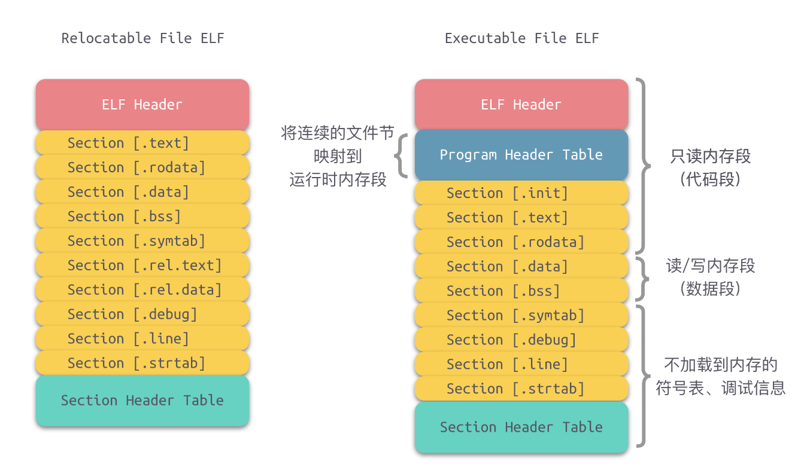


#### 驱动

字符设备驱动、块设备驱动、网络设备驱动


驱动程序、驱动测试程序


驱动模块`.ko`

驱动安装、卸载

```
#include <linux/module.h>	

__init xxx_init() {}
__exit xxx_exit() {}


module_init(xxx_init)
module_exit(xxx_exit)

MODULE_LICSNSE():
MODULE_AUTHOR():
```


驱动命令

```
:
	depmod: 生成.dep文件
	insmod: 安装模块
	lsmod: 查看mod
	mknod: 创建节点
	modprobe: 模块加载
	rmmode:
```


内核函数

```
:
	atomic_t: 原子整型
	atomic64_t:
		ATOMIC_INIT():
	device_node: 设备树节点
		name:
		type:
		property: 节点属性
			name:
			length:
			value:
		
	file:
		private_data:
	mutex: 互斥体
	semaphore: 信号量
	spinlock_t: 自旋锁
	alloc_chrdev_region(dev_t*, unsigned, unsigned, const char*):
	atomic_add():
	atomic_dec_and_test():
	atomic_inc():
	atomic_read():
	atomic_set():
    atomic_sub():
	cdev_add():
	cdev_alloc():
	cdev_del)():
	cdev_init():
	change_bit():
	class_create():
	class_destroy():
	copy_from_user():
	copy_to_user():
	device_create():
	device_destroy():
	gpio_direction_input():
	gpio_direction_output():
	gpio_free():
	gpio_get_value():
	gpio_request():
	gpio_set_value():
	ioremap(): 物理地址转为虚拟地址
	iounmap(): 取消map映射
		readb():
		readw():
		readl():
		writeb():
		writew():
		writel():
	kfree():
	kmalloc():
	kobject_init():
	kobject_put():
	kobject_set_name():
	memcpy():
	mutex_init():
	mutex_is_locked():
	mutex_lock():
	mutex_trylock():
	mutex_unlock():
	of_find_compatible_node():
	of_find_node_by_name(): 返回device_node
	of_find_node_by_path():
	of_find_node_by_type():
	of_find_property(): 返回property
	of_get_named_gpio():
	of_get_next_child():
	of_get_parent():
	of_iomap(): 直接利用设备树存储信息进行内存映射
	of_property_count_elems_of_size():
	of_property_read_string():
	of_property_read_string_index():
	of_property_read_u32():
	of_property_read_u32_array():
	of_property_read_u32_index():
	printk():
	readl():
	register_chrdev():
	register_chrdev_region():
	set_bit(): 原子位操作
	sema_init(): 信号量初始化
		down():
		up():
	spin_is_locked():
	spin_lock():
	spin_lock_init():
	spin_lock_irq():
	spin_lock_irqsave():
	spin_trylock():
	spin_unlock():
	spin_unlock_irq():
	spin_unlock_irqstore():
	unregister_chrdev():
	unregister_chrdev_region():
	writel():
```


Linux C函数

```
:
	open(const char *pathname, int flag):
	read(int fd, void *buf, size_t count): size_t
	write(int fd, void *buf, size_t count): size_t
```


##### 字符设备驱动

`file_operations`

```
:
	owner: module
	read(file*, char* buf, size_t count,loff_t* ppos):
	write(file*, char* buf, size_t count,loff_t* ppos):
	read_iter():
	write_iter():
	poll():
	mmap():
	open(inode*, file*):
	flush():
	release(inode*, file*):
	fsync():
	aio_fsync():
	fasync():
	lock():
	sendpage():
	check_flags():
	flock():
	splice_write():
	splice_read():
	setlease():
	show_fdinfo():
```


`cdev`：字符设备

```
struct cdev {
	struct kobject kobj;
	struct module* owner;
	const struct file_operations* ops;
	struct list_head list;
	dev_t dev;
	unsigned int count;
}
```


注册字符设备

```
:
	register_chrdev(major, minor, file_operations):
	unregister_chrdev():
```


**设备号->设备->绑定操作回调函数->class类->利用class类为设备号创建设备节点->of函数获取设备节点->通过设备节点读取设备树属性(寄存器地址)->地址内存映射操作寄存器**

设备号（主设备号，次设备号），根据设备号创建设备文件节点

注册字符设备（添加设备号、绑定回调函数）

udev设备管理器：自动检测设备号，加载驱动时创建设备文件节点，提供热插拔，

class类管理设备


##### LED驱动

物理地址映射


##### GPIO驱动

pinctrl、gpio：（读取设备树信息）自动化设置PIN的复用和电气属性、配置GPIO复用


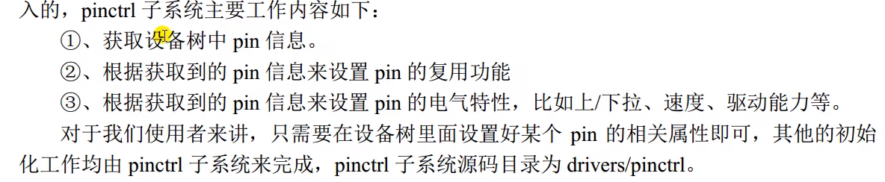


PIN配置信息


pinctrl子系统驱动

pinctrl_desc结构体


gpio驱动

通用IO处理设备

gpiolib、gpiochip

**设备树中为外设定音pin属性节点->外设节点引用pin属性节点->外设节点配置gpio属性**


**设备节点通过of函数获取gpio编号->gpio_request请求申请(避免其他设备使用)->利用gpio进行输入输出**


#### 设备树

DTS、DTB、DTC

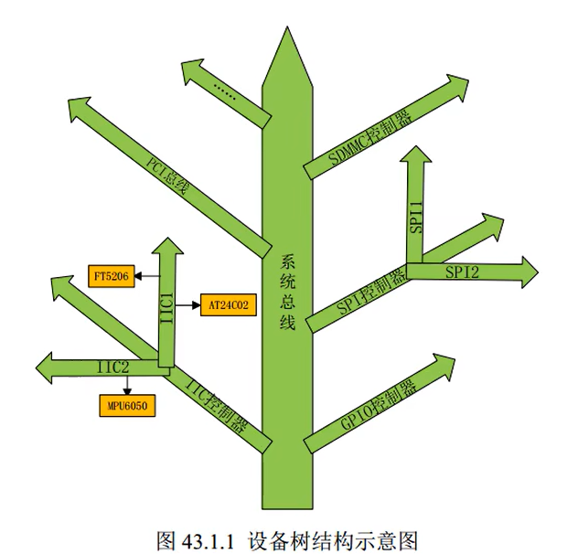

DTC编译器、DTS源码、DTB编译后文件


设备树头文件`.dtsi`

节点

`label: node-name@unit-address`

linux查看设备树节点：`/proc/device-tree/`（子节点用文件夹、属性用文件）

设备树节点解析：

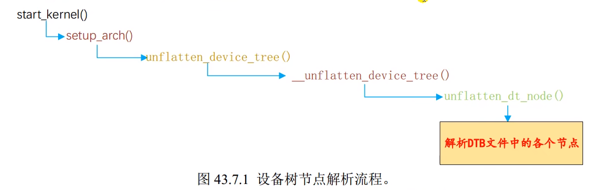


DTS语法

```
#include <dt-bindings/input/input.h>
#include "imx6ull.dtsi"

/ {
	
	model = "": 设备模块信息
	compatible = "": 兼容性列表
	status = "": 可用状态
	reg = <address, size>: 寄存器地址
	ranges: 模块节点地址映射
	pinctrl-names:
	pinctrl-0:
	pins:
	cd-gpios:
	aliases {
	
	};
	chosen {
		stdout-path = &uart1;
	}
	memory {
		device_type = "memory"
		reg = <>
	}
	reserved-memory {
		#address-cells
		#size-cells
		ranges;
		
		linux, cma {
			compatible = 
			reusable;
			size = 
		}
	}
	backlight {
		
	};
	pxp_v4l2 {
	
	};
	regulators {
	
	};
	sound {
	
	};
	spi4 {
	
	};
	cpus {
		#address-cells
		#size-cells
	}
	intc: interrupt-controller@xx{}
	clocks {}
	soc {
		busfreq {
			clocks
		}
		pmu {
		
		}
		ocrams: sram@xx {
		
		}
		ocrams_ddr: sram@xx {
		
		}
		dma_apbh: dma-apbh@xx {
		
		}
		gpmi: gpmi-nand@xx {
		
		}
		aips1: aips-bus@xx {
		
		}
		aips2: aips-bus@xx {
			usbotg1: usb@xx {}
			usbmisc: usbmisc@xx {}
			fec1: ethernet@xx {}
			usdhc1: usdhc@xx {}
			i2c1: i2c@xx {
				mag3110@xx {}
				fxls8471@xx {}
			}
			uart6: serial@xx {}
		}
	}
};


---
&xxx {} 追加内容
```

类似C语言


DTS模板

```
/dts-v1/: 

```


驱动获取设备树节点信息：内核`of_xxx`函数


#### 并发

原子操作：原子整型操作、原子位操作


自旋锁、信号量（线程休眠）、互斥体

顺序锁


