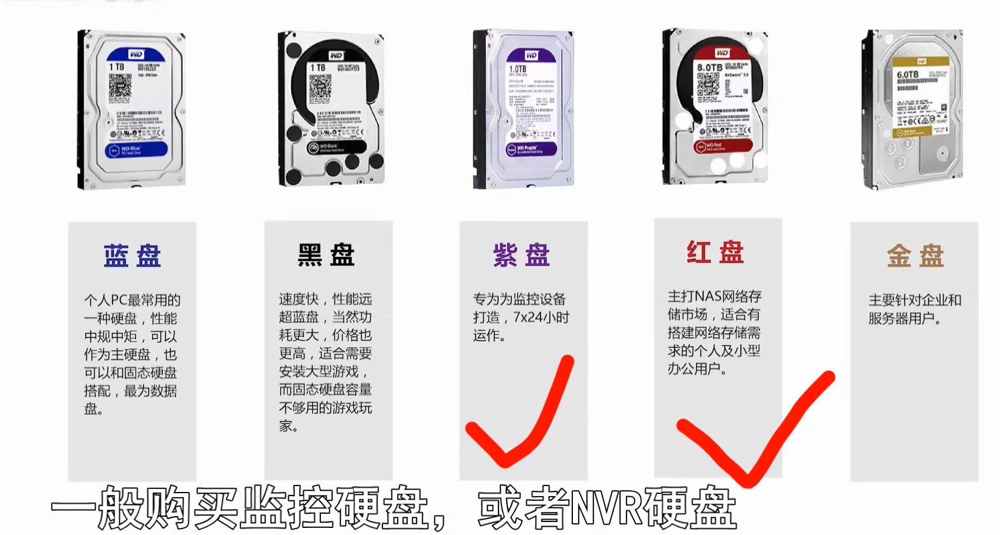
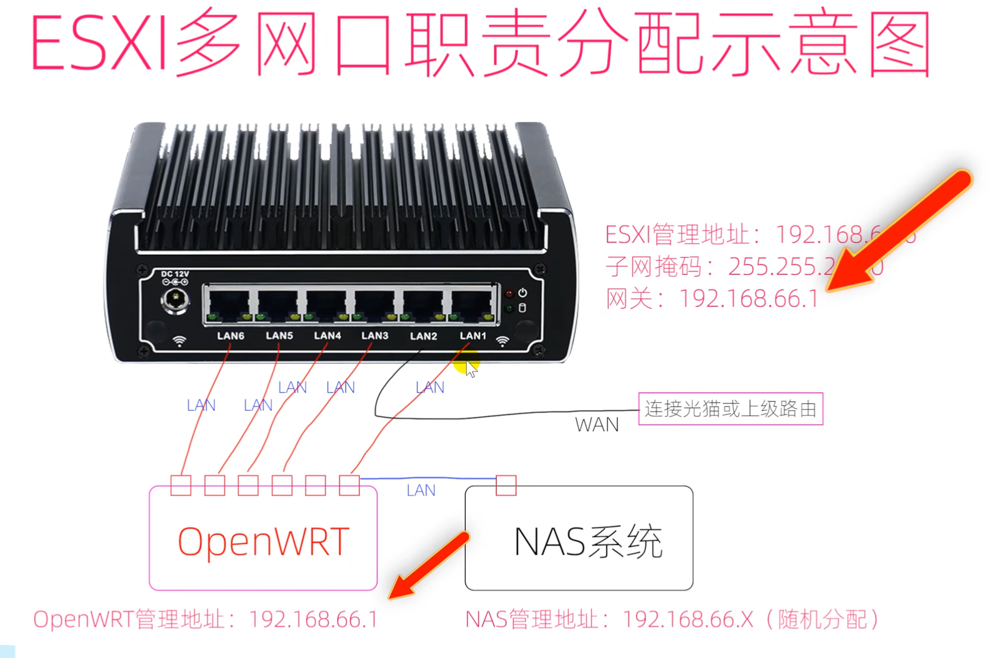

# 硬件

> Author: Sylvie233
>
> Date: 23/7/12
>
> Point:

[TOC]

## 基础介绍

### 服务器

#### 电源

#### 硬盘

#### 内存

#### CPU

#### 显卡

#### 网卡

#### UPS

## 核心内容

### ESXI

服务器级别的虚拟机

#### Rufus

写盘工具	

### OpenWrt

嵌入式设备的Linux操作系统

#### 软路由

旁路由

#### LEDE

#### IKuai

### PVE

服务器级别虚拟机

### 内网穿透

#### Ngrok

`natapp.cn`

​	

#### 花生壳

