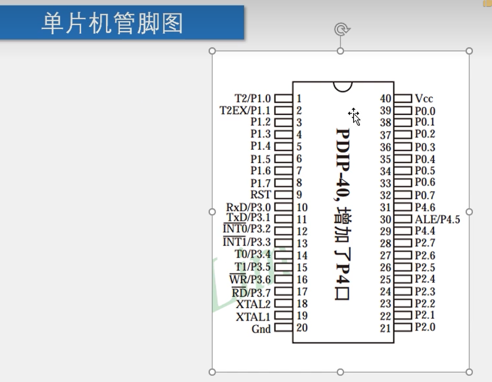
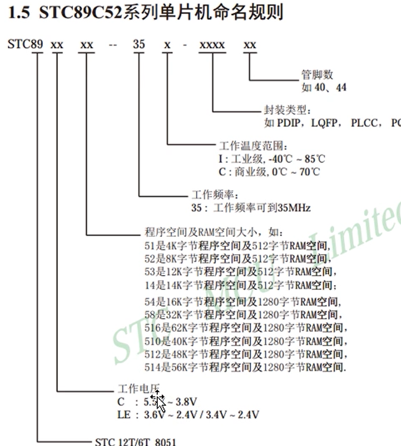
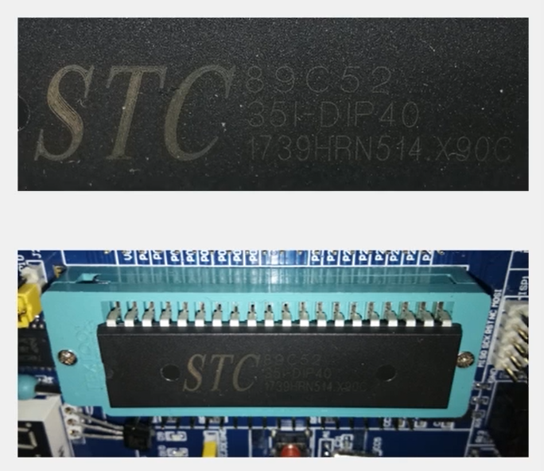
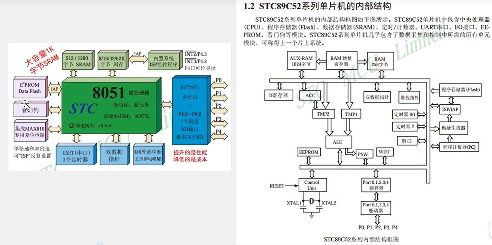
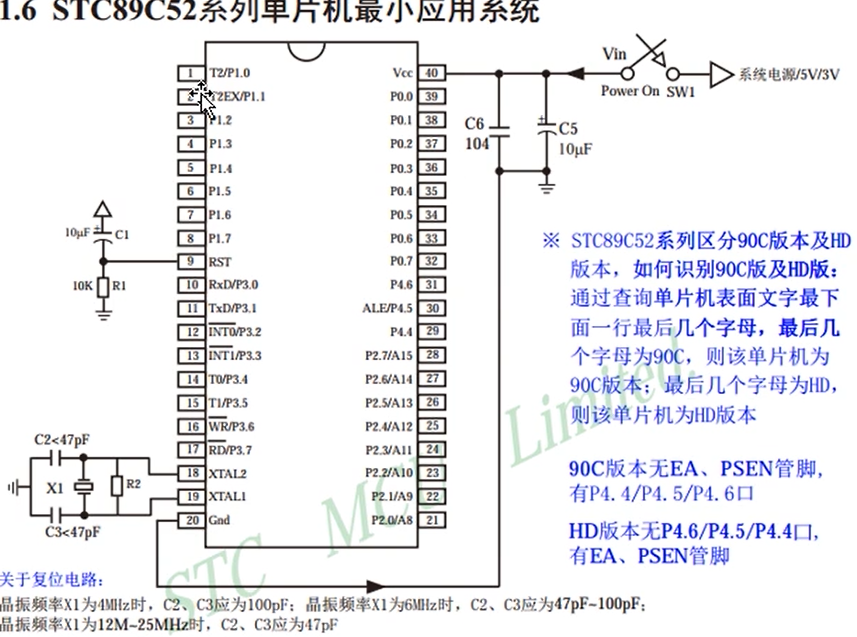
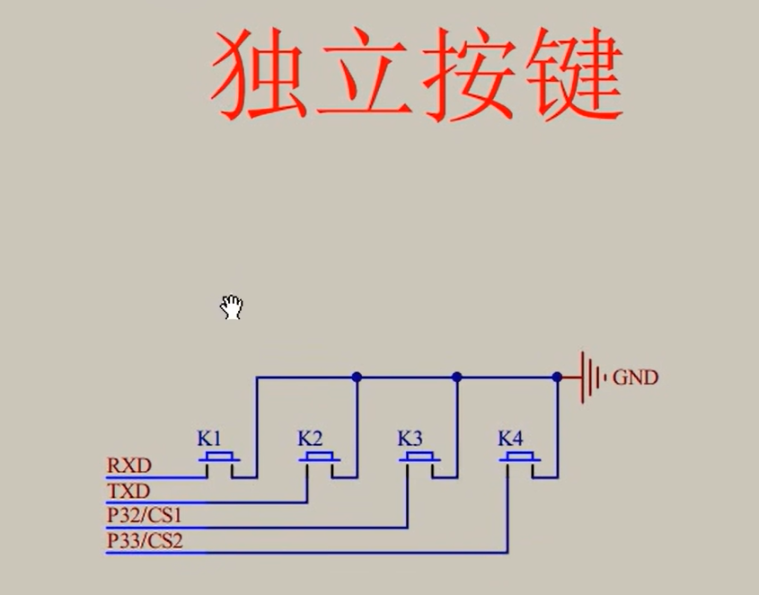
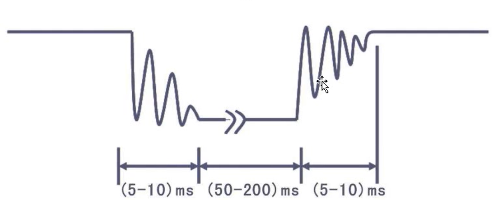

# 单片机

> Author: Sylvie233
>
> Date: 23/5/22
>
> Point: P9

[TOC]

## 基础介绍

### 单片机

#### 管脚




### Keli5


### STC-ISP

程序安装到硬件上`.hex`（编译生成二进制文件）


### STC89C52单片机











## 核心内容

### C

```
<REG52.H>

<REGX52.H>
	P2:
    P2_0:
    P3_1:
	
<INTRINS.H>
	_nop_():
```


### MCU


### LED


#### 独立按键




按键抖动




