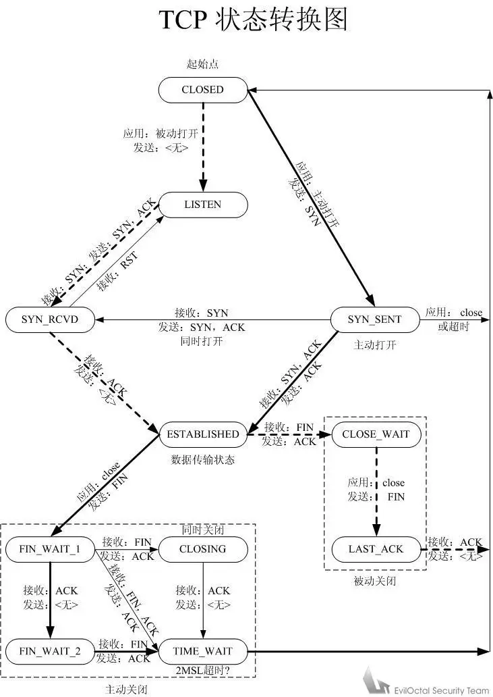
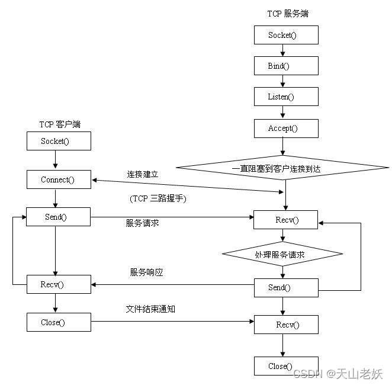

# Linux C++基础

Sylvie233的Linux C++学习~~~

> Author: Sylvie233
>
> Date: 2022/11/10
>
> Update: 2022/11/11
>
> Point: linux系统编程P63

[TOC]

## Linux C++基础

### 静态库

文件：`.a`

归档文件：打包.o文件

ar工具：生成静态库


### 共享库

文件：`.so`


动态库在编译可执行文件时，可执行文件中只记录符号和对应的动态库版本信息

运行时动态加载共享库（共享库在内存中只存在一份）


real name、so name、link name

主版本号、次版本号

链接时只关联动态库的主版本号


ld链接器

配置文件：`/etc/ld.so.conf`

```
添加动态库查找路径
```


ldd命令：查看程序依赖的动态库

```
linux-gate.so.1 => (0xb77e0000)
libc.so.6 => /lib/i386-linux-gnu/libc.so.6(0xb7622000)
...
/lib/ld-linux.so.2(0xb7731000)
```


### 文件I/O

FILE指针

inode、f_pos、buffer

inode文件描述符：文件关联的磁盘中的block块

每个FILE指针都对应一个缓存区


sys_write根据文件描述符，调用文件关联的驱动函数


libc库中的I/O函数都带有缓存区（c标准缓存区），write写入内核缓存区、守护进程定时刷新内核缓存区


pcb中包含进程关联的文件列表

最大打开文件个数：1024

>ulimit -a: 查看open files的限制
>
>ulimit -n: 修改最大文件个数

进程默认关联的3个标准文件流

```
STDIN_FILENO 0
STDOUT_FILENO 1
STDERR_FILENO 2
```


阻塞与非阻塞I/O

read终端输入默认阻塞

终端设备：`/dev/tty`

显示器设备：`/dev/fb0`


### 文件系统

#### ext2

一个磁盘可以划分为多个分区，

磁盘分块：boot块+blocks组（super超级块+块组描述表GDT+块位图+inode位图+inode表+block数据块）

block group

group中数据块统一编址

GDT块描述表

>记录各项偏移和使用情况

inode：128B

>存放文件属性、数据指针（指向数据块）
>
>block[12]：最后一个数据指针不再指向数据块，用来分级间接寻址，

boot块：

>1K大小

super block：

>


ex2寻址

目录：

一个目录分配一个数据块大小（也有对应的inode）

存储记录项：文件名+inode+记录长度+文件类型


文件查找：目录逐级解析（open）

根目录（/）在inode编号为2的节点上（固定）


#### 虚拟文件系统

VFS中间层（文件系统抽象）

fd的file结构体关联了一组文件操作的函数（驱动层函数）、一组inode操作的函数（驱动层函数）

NTFS、EXT3、FAT32

file结构体

>文件读写位置，文件驱动操作函数


### 进程控制

#### PCB

进程控制块 

task_struct结构体

简化pcb

```c++
struct task_struct {
    pid_t pid;
    struct files_struct *files;
};

进程信息:
	1. 进程id
    2. 进程状态
    3. 
```


#### 虚拟地址空间

linux内核运行在内存高地址处

虚拟内存映射表

page页


cpu工作级别

软中断int切换


#### 进程状态

```
进程状态:
	S: sleep
	R: run
	Z: 僵尸
```


环境变量（全局）：environ


僵尸进程：

进程结束、但父进程并未对此回收（进程用户空间释放，内核空间pcb未释放）

wait回收僵尸进程（阻塞）（没有子进程返回-1）

僵尸进程可以知道子进程的结束原因（异常结束）


孤儿进程：

父进程先于子进程结束，子进程的父进程变为1号init进程（init进程领养孤儿进程）


进程组：

组id和父进程pid一致


#### 进程调度

时间片

cpu分时复用


#### 进程原语

fork进程clone进程空间，

读时共享，写时复制（fork完时并非立即申请一块物理内存）


fork+exec


#### 进程间关系

终端

tty、pts

tty7字符终端

终端开启：

```
init -> fork -> exec -> getty -> login -> exec -> shell
```

当前终端：`/dev/tty`

PCB中保存了当前进程的控制终端（进程可以没有控制终端）

网络终端：


进程组


会话

```
终端 -> 会话 -> 进程组 -> 进程
```

SIGHUP信号：当shell进程关闭时，属于同一个会话中的进程（由shell创建的进程）会收到该信号，默认关闭进程处理

sid


#### 守护进程

Daemon（精灵）进程，后台服务进程

通常独立于控制终端（tty为?）

守护进程不等于后台运行进程？

```
守护进程:
	1. 创建子进程，父进程退出
	2. 在子进程中创建新会话
	3. 改变当前目录为根目录
	4. 重设文件权限掩码
	5. 关闭文件描述符
	6. 退出处理
```


### 进程通信

内核缓存区

IPC通信（进程间通信）


#### 管道

pipe管道

有血缘关系的进程之间通信，单向通信


fifo有名管道

无血缘关系进程通信

创建file管道文件（inode仅用于索引内核中的缓存区，不会在磁盘中保存数据）


fcntl控制I/O阻塞


#### 内存映射

mmap可以把磁盘文件中的一部分映射到内存中（利用磁盘文件进行交互，也会经过内核缓存区）

两个进程映射同一个文件到各自内存中，实现内存同时修改

sprintf往指定内存地址中写入数据

字符指针直接读取指定地址的数据


文件权限与mmap权限应该匹配


进程中通信的文件应该使用临时文件


#### 信号

信号列表：

前32个信号给软件使用

```
kill -l:
	2)SIGINT: （Ctrl+C）
	8)SIGFPE: 除零
	9)SIGKILL: 结束
    11)SIGSEGV: 段错误
    14)SIGALRM: 定时器
	16)SIGCHLD: 子进程结束向父进程发送该信号
	20)SIGTSTP: （ctrl+z）
	SIGQUIT: （ctrl+\）
	
```


信号机制

kill函数

每个进程关联一个定时器

信号处理：

```
signal处理:
	1.默认处理：
        Term: 终止进程
        Ign: 忽略
        Core: 终止并生成core文件
        Stop: 暂停
        Cont: 继续
    2.忽略
    3.捕捉
```


信号集sigset_t

PCB的信号集：

PEND未决信号集（信号来了则相应位置1、由内核自动设置）、Block阻塞信号集（类似未决信号集的掩码、为1则阻塞）、信号Handler（信号响应）

未决态、抵达态

用户可显式设置Block阻塞信号集


信号捕捉

sigaction

执行信号处理函数时，block对应位自动置1，

使用SIGUSR1、SIGUSR2用户自定义信号进行进程通信

子进程继承了父进程的信号屏蔽字和处理函数

可重入函数、不可重入函数，异步信号安全函数


sleep=pause+alarm


原子类型：

sig_atomic_t、volatile（强制每次都从内存中读取该变量的值，）


SIGCHLD信号

子进程结束信号、子进程收到SIGSTOP停止信号、


信号中断系统调用


#### Unix Domain Socket

利用socket实现进程通信


### 网络编程

#### 网络基础

OSI七层模型、TCP/IP四层模型

内核中的TCP/IP协议栈


DNS服务器

域名解析器


MTU：最大传输单元（使用的底层传输）

```
MTU:
	以太网（Ethernet）协议: 1500字节
	P2P协议: 4470字节
```


NAT

内网地址转换、映射


##### 路由

TTL


路由器

IP地址

对内地址、对外地址


交换机

MAC地址


hub中继器


##### 以太网帧

底层基础传输单元

MTU：最大传输单元（46-1500）

```
以太网首部: 14字节
	目的地址: 6
	源地址: 6
	类型: 2
		ARP:
		RARP: 

以太网尾部: 4字节
	CRC: 4
```


MAC地址：48位（6字节）


##### ARP协议

IP地址寻找对应的MAC地址

广播包

ARP响应报文

```
ARP报文: 28字节
	硬件类型: 2
	协议类型: 2
	硬件地址长度: 1
	协议地址长度: 1
	op: 2
	发送端以太网地址: 6
	发送端IP地址: 4
	目的以太网地址: 6
	目的IP地址: 4

PAD: 填充18字节
```


##### RARP协议


##### IP协议


```
IP段首部：（20-
	4字节:
		4: 版本
		4: 首部长度
		8: 服务类型
		16:: 总长度（字节数）
	4字节:
		16: 标识
		3: 标志
		13: 片偏移
	4字节:
		8: TTL生存时间
		8: 协议
		16: 首部校验和
	4字节:
		32: 源IP地址
	4字节:
		32: 目的IP地址
	?字节:
		选项

IP段数据:
	
```


##### ICMP协议

##### IGMP协议

##### TCP协议


```
TCP首部:
	16: 源端口
	16: 目的端口
	32: 序号
	32: 确认序号
	4: 首部长度
	6: 保留
	6: 标志
		URG:
		ACK:
		PSH:
		RST:
		SYN:
		FIN:
	16: 窗口大小
	16: 校验和
	16: 紧急指针
	?: 选项
	
TCP数据:
	
```


TCP状态转换：




TCP滑动窗口

win、mss


TCP半链接状态

可以接受数据包，无法发包


##### UDP协议


```
UDP首部: 8字节
	16: 源端口
	16: 目的端口
	16: UDP长度
	16: UDP校验和
	
UDP数据:
	
```


广播


组播

255

组地址、IP层


##### HTTP协议


#### Socket

网络字节序：大端存储

字节序转换：

```
#include <arpa/inet.h>

uint32_t htonl(uint32_t hostlong)
uint32_t ntohl(uint32_t hostlong)


```


sockaddr

sockaddr_in


##### TCP




### 线程

线程是轻量级进程，也有PCB，也是通过clone创建的

从内核来看，进程和线程是一样的，不同的PCB，但PCB中指向内存的三级页表是一样的

进程的主控线程

线程=寄存器+栈

LWP


线程调度


线程资源共享

```
共享资源:
	1.文件描述符表哦
	2.信号处理函数
	3.当前工作目录
	4.用户id、组id
	5.内存地址空间
	
非共享资源:
	1.线程id
	2.处理器现场、栈指针（内核栈）
	3.独立的栈空间
	4.errno
	5.信号屏蔽字
	6.调度优先级
```


线程原语

编译时指定pthread库：`-lpthread`

pthread线程库版本：`NPTL`

tid

pthread_create、

僵尸线程\


分离态线程：

默认情况下，线程终止后，其终止状态一直保留到其它线程调用pthread_join进行回收，而分离态线程在线程结束后立即回收资源，而不保留终止状态

无法继续join


线程属性


线程栈地址


线程池


#### 线程同步


### I/O复用

#### select


#### poll

#### epoll


### 异步I/O


## 常用API

### \<arpa/inet.h>

### \<dirent.h>

### <fcntl.h>

### \<netdb.h>

### \<poll.h>

### \<pthread.h>

### \<signal.h>

### \<strings.h>

### \<sys/epoll.h>

### \<sys/ioctl.h>

### \<sys/mman.h>

### \<sys/select.h>

### \<sys/socket.h>

### <sys/stat.h>

### \<sys/time.h>

### <sys/types.h>

### \<sys/wait.h>

### <unistd.h>

### \<utime.h>


### 


### accept

```
#include <sys/types.h>          /* See NOTES */
#include <sys/socket.h>

int accept(int sockfd, struct sockaddr *addr, socklen_t *addrlen);

// 16字节地址
struct sockaddr {
	sa_family_t sa_family;
	char sa_data[14];
};

// 16字节地址（8字节填充）
struct sockaddr_in {
	__kernel_sa_family_t sin_family;
	__be16 sin_port;         /* 16位的端口 */
	struct in_addr sin_addr; /* 32位的IP */
};

struct in_addr {
	__be32 s_addr;
};

struct sockaddr_un {
	
};
```


### access

权限判断

```
#include <unistd.h>

int access(const char *pathname, int mode)
	mode:
		R_OK: 读权限
```


### alarm

```
#include <unistd.h>

unsigned int alarm(unsigned int seconds);
```


### bzero

```
#include <strings.h>

void bzero(void *s, size_t n);
```


### bind

```
#include <sys/types.h>          /* See NOTES */
#include <sys/socket.h>

int bind(int sockfd, const struct sockaddr *addr, socklen_t addrlen);
```


### chdir

改变当前进程的工作目录

```
#include <unistd.h>

int chdir(const char *path);
int fchdir(int fd);
```


### chmod

```
#include <sys/stat.h>

int chmod(const char *path, mode_t mode)
int fchmod(int fd, mode_t mode)
```


### chown

```
#include <unistd.h>

int chown(const char *path, uid_t owner, gid_t group);
int fchown(int fd, uid_t owner, gid_t group)
int lchown(const char *path, uid_t owner, gid_t group);
```


### close

```
#include <unistd.h>

int close(int fd)
```


### closedir

```
#include <sys/types.h>
#include <dirent.h>

int closedir(DIR *dirp);
```


### connect

```
#include <sys/types.h>          /* See NOTES */
#include <sys/socket.h>

int connect(int sockfd, const struct sockaddr *addr,
           socklen_t addrlen);
```


### creat

```
#include <sys/types.h>
#include <sys/stat.h>
#include <fcntl.h>

int creat(const char *pathname, mode_t mode)
```


### dup

复制文件描述符，不同的fd关联同一个file结构体

可用于输出重定向

```
#include <unistd.h>

int dup(int oldfd);
int dup2(int oldfd, int newfd);

#define _GNU_SOURCE             /* See feature_test_macros(7) */
#include <fcntl.h>              /* Obtain O_* constant definitions */
#include <unistd.h>

int dup3(int oldfd, int newfd, int flags);
```


### epoll

事件机制

文件描述符上限

epoll句柄

红黑树


```
#include <sys/epoll.h>

int epoll_create(int size);
int epoll_create1(int flags);
int epoll_ctl(int epfd, int op, int fd, struct epoll_event *event);
	op:
		EPOLL_CTL_ADD:
		EPOLL_CTL_DEL:
		EPOLL_CTL_MOD:
		
int epoll_wait(int epfd, struct epoll_event *events, int maxevents, int timeout);
	events: 就绪的文件描述符（传出参数）
	返回值: 就绪个数
		

int epoll_pwait(int epfd, struct epoll_event *events, int maxevents, int timeout, const sigset_t *sigmask);

typedef union epoll_data {
   void        *ptr;
   int          fd;
   uint32_t     u32;
   uint64_t     u64;
} epoll_data_t;

struct epoll_event {
   uint32_t     events;      /* Epoll events */
   epoll_data_t data;        /* User data variable */
};
	events:
		EPOLLIN:
		EPOLLOUT:
		
```


### exec

执行其他任务，实现任务切换（代码段替换为指定任务）、当前任务后面代码不会执行


```
#include <unistd.h>

extern char **environ;

// path为绝对路径
int execl(const char *path, const char *arg, ...);
// file可从path中寻找（搜索环境变量）
int execlp(const char *file, const char *arg, ...);
int execle(const char *path, const char *arg,
          ..., char * const envp[]);
// 参数以数组方式传递
int execv(const char *path, char *const argv[]);
int execvp(const char *file, char *const argv[]);
int execvpe(const char *file, char *const argv[],
           char *const envp[]);
```


### fchmod


### fchown


### fcntl

获取、修改文件描述符关联的flag属性

```
#include <unistd.h>
#include <fcntl.h>

int fcntl(int fd, int cmd, ... /* arg */)
	cmd:
		F_GETFL: 获取标志
        F_SETFL: 设置标志
    flags:
    	open对应的O_标志
```


### fork

调用一次，返回两次（父进程返回pid，子进程返回0）

```
#include <unistd.h>

pid_t fork(void);
```


### fstat


### getcwd

```
 #include <unistd.h>

char *getcwd(char *buf, size_t size);
char *getwd(char *buf);
char *get_current_dir_name(void);
```


### gethostbyname

```
#include <netdb.h>
extern int h_errno;

struct hostent *gethostbyname(const char *name);

struct hostent {
   char  *h_name;            /* official name of host */
   char **h_aliases;         /* alias list */
   int    h_addrtype;        /* host address type */
   int    h_length;          /* length of address */
   char **h_addr_list;       /* list of addresses */
}


#include <sys/socket.h>       /* for AF_INET */
struct hostent *gethostbyaddr(const void *addr,
                             socklen_t len, int type);

void sethostent(int stayopen);

void endhostent(void);

void herror(const char *s);

const char *hstrerror(int err);

/* System V/POSIX extension */
struct hostent *gethostent(void);

/* GNU extensions */
struct hostent *gethostbyname2(const char *name, int af);

int gethostent_r(
       struct hostent *ret, char *buf, size_t buflen,
       struct hostent **result, int *h_errnop);

int gethostbyaddr_r(const void *addr, socklen_t len, int type,
       struct hostent *ret, char *buf, size_t buflen,
       struct hostent **result, int *h_errnop);

int gethostbyname_r(const char *name,
       struct hostent *ret, char *buf, size_t buflen,
       struct hostent **result, int *h_errnop);

int gethostbyname2_r(const char *name, int af,
       struct hostent *ret, char *buf, size_t buflen,
       struct hostent **result, int *h_errnop);
```


### getgid

```
#include <unistd.h>
#include <sys/types.h>

gid_t getgid(void);
gid_t getegid(void);
```


### getpid

```
#include <sys/types.h>
#include <unistd.h>

pid_t getpid(void);
pid_t getppid(void);
```


### getsockname

```
#include <sys/socket.h>

int getsockname(int sockfd, struct sockaddr *addr, socklen_t *addrlen);
```


### getuid

```
#include <unistd.h>
#include <sys/types.h>

uid_t getuid(void);
uid_t geteuid(void);
```


### inet_pton

```
#include <arpa/inet.h>

int inet_pton(int af, const char *src, void *dst);
```


### ioctl

获取、设置**设备文件**的**物理特性**

向设备（端口）发送控制命令

```
#include <sys/ioctl.h>

int ioctl(int d, int request, ...)
```


### kill

```
#include <sys/types.h>
#include <signal.h>

int kill(pid_t pid, int sig);
```


### lchown


### link

```
#include <unistd.h>

int link(const char *oldpath, const char *newpath);
```


### listen

```
#include <sys/types.h>          /* See NOTES */
#include <sys/socket.h>

int listen(int sockfd, int backlog);
	backlog: 排队建立3次握手队列和刚刚建立3次握手队列的链接数和
		128
```


### lseek

指针偏移

```
#include <sys/types.h>
#include <unistd.h>

off_t lseek(int fd, off_t offset, int whence)
	whence:
		SEEK_SET: 开头
		SEEK_END: 末尾
```


### lstat


### mkdir

```
#include <sys/stat.h>
#include <sys/types.h>

int mkdir(const char *pathname, mode_t mode);
```


### mkfifo

创建fifo管道文件

```
#include <sys/types.h>
#include <sys/stat.h>

int mkfifo(const char *pathname, mode_t mode);
```


### mmap

```
#include <sys/mman.h>

void *mmap(void *addr, size_t length, int prot, int flags,
          int fd, off_t offset);
int munmap(void *addr, size_t length);
	addr: 虚拟地址
		NULL: 自己寻找地址
	prot: 权限
		PROT_READ: 读
		
	flags:
		MAP_SHARED: 共享映射
	fd: 文件描述符
	offset: 文件偏移（4096倍数）
```


### open

```
#include <sys/types.h>
#include <sys/stat.h>
#include <fcntl.h>

int open(const char *pathname, int flags);
int open(const char *pathname, int flags, mode_t mode)
	flags: 标志
		O_CREAT: 创建
		O_RDWR: 可读可写
		O_APPEND: 追加
		O_WRONLY: 只写
		O_RDONLY: 只读
		O_TRUNC: 截断
		O_EXCL: 已存在则出错返回
		O_NONBLOCK: 非阻塞I/O
		
	mode: 权限
		0644
	
返回值:
	-1: 打开失败
	fd: 文件描述符（进程文件描述符表中未使用的最小的值）
```


### opendir

```
#include <sys/types.h>
#include <dirent.h>

DIR *opendir(const char *name);
DIR *fdopendir(int fd);
```


### pathconf

```
#include <unistd.h>

long fpathconf(int fd, int name);
long pathconf(char *path, int name);
```


### pause

进程挂起

```
#include <unistd.h>

int pause(void);
```


### pipe

单工通信

```
#include <unistd.h>

int pipe(int pipefd[2]);
	pipefd: 输出参数
		读端[0]、写端[1]文件描述符

#define _GNU_SOURCE             /* See feature_test_macros(7) */
#include <fcntl.h>              /* Obtain O_* constant definitions */
#include <unistd.h>

int pipe2(int pipefd[2], int flags);
```


### poll

阻塞

事件机制

```
#include <poll.h>

int poll(struct pollfd *fds, nfds_t nfds, int timeout);
	fds:
	nfds:
	timeout:
		-1: zuse
		0: 非阻塞
		n:
	返回值: 激活个数
		
struct pollfd {
   int   fd;         /* 文件描述符 */
   short events;     /* 监控的事件 */
   short revents;    /* 返回的事件 */
};
	fd:
		-1: 取消监控
	events: 事件
		POLLIN: 
		POLLRDNORM:
		POLLRDBAND:
		POLLOUT:
		POLLWRNORM:
		POLLERR:
		POLLHUP:
	revents: 事件相与判断	


#define _GNU_SOURCE         /* See feature_test_macros(7) */
#include <poll.h>

int ppoll(struct pollfd *fds, nfds_t nfds,
       const struct timespec *timeout_ts, const sigset_t *sigmask);
```


### pthread_attr_init

```
#include <pthread.h>

int pthread_attr_init(pthread_attr_t *attr);
int pthread_attr_destroy(pthread_attr_t *attr);


typedef struct
{
       int                       detachstate;   // 线程的分离状态
       int                       schedpolicy;   // 线程调度策略
       structsched_param         schedparam;    // 线程的调度参数
       int                       inheritsched;  // 线程的继承性
       int                       scope;         // 线程的作用域
       size_t                    guardsize;     // 线程栈末尾的警戒缓冲区大小
       int                       stackaddr_set; // 线程的栈设置
       void*                     stackaddr;     // 线程栈的位置
       size_t                    stacksize;     // 线程栈的大小
} pthread_attr_t;
```


### pthread_attr_setdetachstate

```
#include <pthread.h>

int pthread_attr_setdetachstate(pthread_attr_t *attr, int detachstate);
int pthread_attr_getdetachstate(pthread_attr_t *attr, int *detachstate);
```


### pthread_attr_setstack

```
#include <pthread.h>

int pthread_attr_setstack(pthread_attr_t *attr,
                         void *stackaddr, size_t stacksize);
int pthread_attr_getstack(pthread_attr_t *attr,
                         void **stackaddr, size_t *stacksize);
```


### pthread_attr_setstackaddr

```
#include <pthread.h>

int pthread_attr_setstackaddr(pthread_attr_t *attr, void *stackaddr);
int pthread_attr_getstackaddr(pthread_attr_t *attr, void **stackaddr);
```


### pthread_cancel

线程内取消另一个线程

被取消线程并不会立即结束，只有当该线程下一次系统调用时才会结束

```
#include <pthread.h>

int pthread_cancel(pthread_t thread);
```


### pthread_create

```
#include <pthread.h>

int pthread_create(pthread_t *thread, const pthread_attr_t *attr,
                  void *(*start_routine) (void *), void *arg);
```


### pthread_detach

```
#include <pthread.h>

int pthread_detach(pthread_t thread);
```


### pthread_equal

```
#include <pthread.h>

int pthread_equal(pthread_t t1, pthread_t t2);
```


### pthread_exit

```
#include <pthread.h>

void pthread_exit(void *retval);
```


### pthread_join

线程回收，阻塞

```
#include <pthread.h>

int pthread_join(pthread_t thread, void **retval);
```


### pthread_self

```
#include <pthread.h>

pthread_t pthread_self(void);
```


### pthread_testcancel

```
#include <pthread.h>

void pthread_testcancel(void);
```


### raise

```
#include <signal.h>

int raise(int sig);
```


### read

```
#include <unistd.h>

ssize_t read(int fd, void *buf, size_t count)

返回值:
	-1: 异常
	0: 读取到文件末尾
	n: 读取的字节个数
```


### readdir

每次返回一个记录项（DIR*指针偏移）（NULL、errno）

```
#include <dirent.h>

struct dirent *readdir(DIR *dirp);

int readdir_r(DIR *dirp, struct dirent *entry, struct dirent **result);

struct dirent {
   ino_t          d_ino;       /* inode number */
   off_t          d_off;       /* not an offset; see NOTES */
   unsigned short d_reclen;    /* length of this record */
   unsigned char  d_type;      /* type of file; not supported
                                  by all file system types */
   char           d_name[256]; /* filename */
};
```


### readlink

获取符号链接关联的文件名

```
#include <unistd.h>

ssize_t readlink(const char *path, char *buf, size_t bufsiz);
```


### recv

```
#include <sys/types.h>
#include <sys/socket.h>

ssize_t recv(int sockfd, void *buf, size_t len, int flags);
ssize_t recvfrom(int sockfd, void *buf, size_t len, int flags,
                struct sockaddr *src_addr, socklen_t *addrlen);
ssize_t recvmsg(int sockfd, struct msghdr *msg, int flags);
	
```


### rename

```
#include <stdio.h>

int rename(const char *oldpath, const char *newpath);
```


### rewinddir

```
#include <sys/types.h>
#include <dirent.h>

void rewinddir(DIR *dirp);
```


### rmdir

```
#include <unistd.h>

int rmdir(const char *pathname);
```


### select

阻塞操作

最多一般1024


```
#include <sys/select.h>
#include <sys/time.h>
#include <sys/types.h>
#include <unistd.h>

int select(int nfds, fd_set *readfds, fd_set *writefds,
          fd_set *exceptfds, struct timeval *timeout);
	nfds: 最大描述符+1
	timeout: 
		NULL: 永远等待
		timeval零值: 检测后立即返回、轮询
	返回值:
    	有信号文件描述符的个数

void FD_CLR(int fd, fd_set *set);
int  FD_ISSET(int fd, fd_set *set);
void FD_SET(int fd, fd_set *set);
void FD_ZERO(fd_set *set);

struct timeval {
   long    tv_sec;         /* seconds */
   long    tv_usec;        /* microseconds */
};


#include <sys/select.h>

int pselect(int nfds, fd_set *readfds, fd_set *writefds, fd_set *exceptfds, const struct timespec *timeout, onst sigset_t *sigmask);
```


### send

```
#include <sys/types.h>
#include <sys/socket.h>

ssize_t send(int sockfd, const void *buf, size_t len, int flags);

ssize_t sendto(int sockfd, const void *buf, size_t len, int flags,
              const struct sockaddr *dest_addr, socklen_t addrlen);

ssize_t sendmsg(int sockfd, const struct msghdr *msg, int flags);
```


### setsid

```
#include <unistd.h>

pid_t setsid(void);
```


### setsockopt

```
#include <sys/types.h>          /* See NOTES */
#include <sys/socket.h>

int getsockopt(int sockfd, int level, int optname,
              void *optval, socklen_t *optlen);
int setsockopt(int sockfd, int level, int optname,
              const void *optval, socklen_t optlen);
	level: 层
		IPPROTO_IP:
		
	optname:
		IP_MULTICAST_IF:
		IP_ADD_MEMBERSHIP:
		
```


### shutdown。

```
#include <sys/socket.h>

int shutdown(int sockfd, int how);
	how:
		SHUT_RD: 关闭连接的读端
		SHUT_WR: 关闭连接的写端
```


### sigaction

注册信号处理函数

```
#include <signal.h>

int sigaction(int signum, const struct sigaction *act, struct sigaction *oldact);
	signum:
	act:

struct sigaction {
   void     (*sa_handler)(int); /* 信号处理函数（无参） */
   void     (*sa_sigaction)(int, siginfo_t *, void *);
   sigset_t   sa_mask;
   /*
   		1.
   */
   int        sa_flags;
   void     (*sa_restorer)(void);
};

内置处理函数:
	SIG_DEL:
	SIG_IGN: 


siginfo_t {
   int      si_signo;    /* Signal number */
   int      si_errno;    /* An errno value */
   int      si_code;     /* Signal code */
   int      si_trapno;   /* Trap number that caused
                            hardware-generated signal
                            (unused on most architectures) */
   pid_t    si_pid;      /* Sending process ID */
   uid_t    si_uid;      /* Real user ID of sending process */
   int      si_status;   /* Exit value or signal */
   clock_t  si_utime;    /* User time consumed */
   clock_t  si_stime;    /* System time consumed */
   sigval_t si_value;    /* Signal value */
   int      si_int;      /* POSIX.1b signal */
   void    *si_ptr;      /* POSIX.1b signal */
   int      si_overrun;  /* Timer overrun count; POSIX.1b timers */
   int      si_timerid;  /* Timer ID; POSIX.1b timers */
   void    *si_addr;     /* Memory location which caused fault */
   long     si_band;     /* Band event (was int in
                            glibc 2.3.2 and earlier) */
   int      si_fd;       /* File descriptor */
   short    si_addr_lsb; /* Least significant bit of address
                            (since Linux 2.6.32) */
}
```


### sigpending

读取未决信号集

```
#include <signal.h>

int sigpending(sigset_t *set);
```


### sigprocmask

```
#include <signal.h>

int sigprocmask(int how, const sigset_t *set, sigset_t *oldset);
	how:
		
```


### sigqueue

```
#include <signal.h>

int sigqueue(pid_t pid, int sig, const union sigval value);

union sigval {
   int   sival_int;
   void *sival_ptr;
};
```


### sigsuspend

```
#include <signal.h>

int sigsuspend(const sigset_t *mask);
```


### sleep

```
#include <unistd.h>

unsigned int sleep(unsigned int seconds)
```


### socket

```
#include <sys/types.h> 
#include <sys/socket.h>

int socket(int domain, int type, int protocol);
	domain: 地址族
		AF_INET: 大多数用来产生socket的协议
		AF_INET6:
	type: 类型
		SOCK_STREAM: 安全连接
		SOCK_DGRAM: 无连接
	protocol: 协议
		0: 默认协议
```


### stat

```
#include <sys/types.h>
#include <sys/stat.h>
#include <unistd.h>

int stat(const char *path, struct stat *buf)
int fstat(int fd, struct stat *buf)
int lstat(const char *path, struct stat *buf)

struct stat {
   dev_t     st_dev;     /* ID of device containing file */
   ino_t     st_ino;     /* inode编号 */
   mode_t    st_mode;    /* 权限（文件类型） */
   nlink_t   st_nlink;   /* number of hard links */
   uid_t     st_uid;     /* 所有者 */
   gid_t     st_gid;     /* 所有组 */
   dev_t     st_rdev;    /* device ID (if special file) */
   off_t     st_size;    /* 文件大小（byte） */
   blksize_t st_blksize; /* blocksize for file system I/O */
   blkcnt_t  st_blocks;  /* number of 512B blocks allocated */
   time_t    st_atime;   /* 最近访问时间 */
   time_t    st_mtime;   /* 最近内容修改时间 */
   time_t    st_ctime;   /* 最近inode修改时间 */
};

st_mode掩码:
	S_IFMT: 文件类型
	S_IFDIR: 目录
```


### symlink

```
#include <unistd.h>

int symlink(const char *oldpath, const char *newpath);
```


### truncate

```
#include <unistd.h>
#include <sys/types.h>

int truncate(const char *path, off_t length);
int ftruncate(int fd, off_t length);
```


### unlink

```
#include <unistd.h>

int unlink(const char *pathname);
```


### umask

```
#include <sys/types.h>
#include <sys/stat.h>

mode_t umask(mode_t mask)
```


### utime

```
#include <sys/types.h>
#include <utime.h>

int utime(const char *filename, const struct utimbuf *times);

#include <sys/time.h>

int utimes(const char *filename, const struct timeval times[2]);
```


### wait

返回回收的子进程pidd

```
#include <sys/types.h>
#include <sys/wait.h>

pid_t wait(int *status);
pid_t waitpid(pid_t pid, int *status, int options);
	status: 32位记录值
		1. 退出值
		2. 信号值
	pid: 指定wait的pid
		-n: 进程组id
		-1: 任意子进程
		0: 父进程同一组的所有子进程
		n: 指定pid
	options: 

status宏:
	WIFEXITED: 正常退出
	WIFSIGALED: 被信号终止
		
int waitid(idtype_t idtype, id_t id, siginfo_t *infop, int options);
```


### write


```
#include <unistd.h> 

ssize_t write(int fd, const void *buf, size_t count)
```

