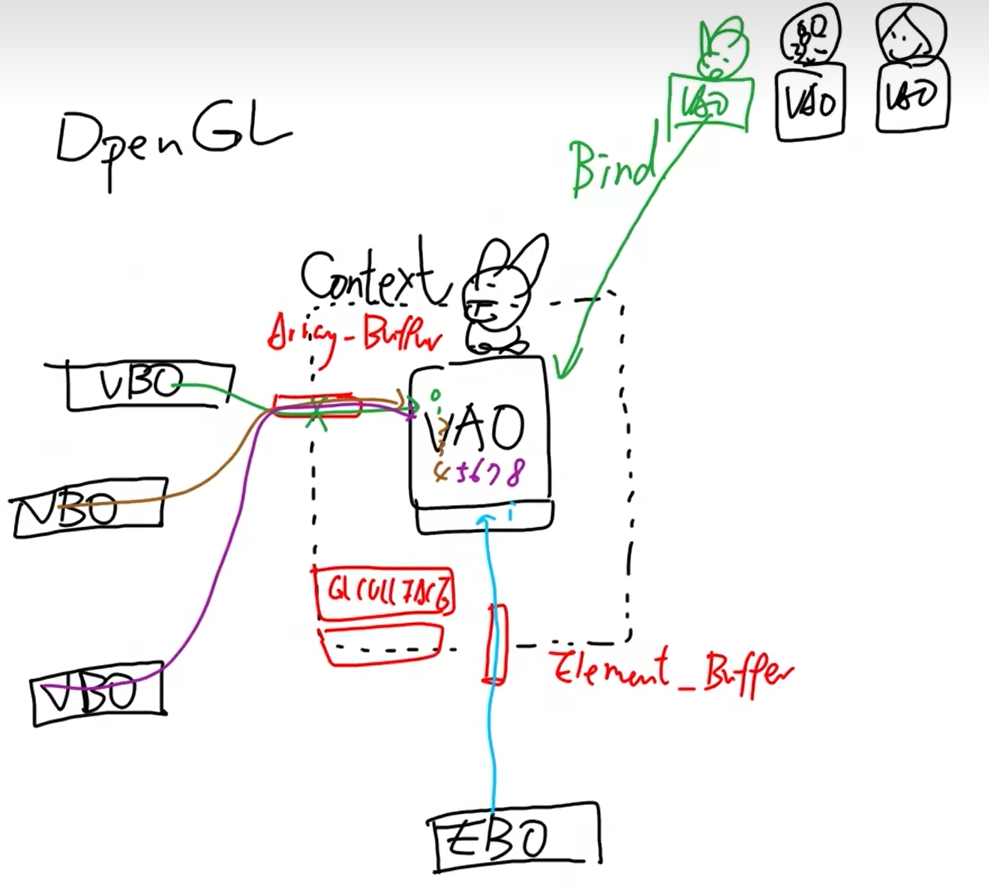
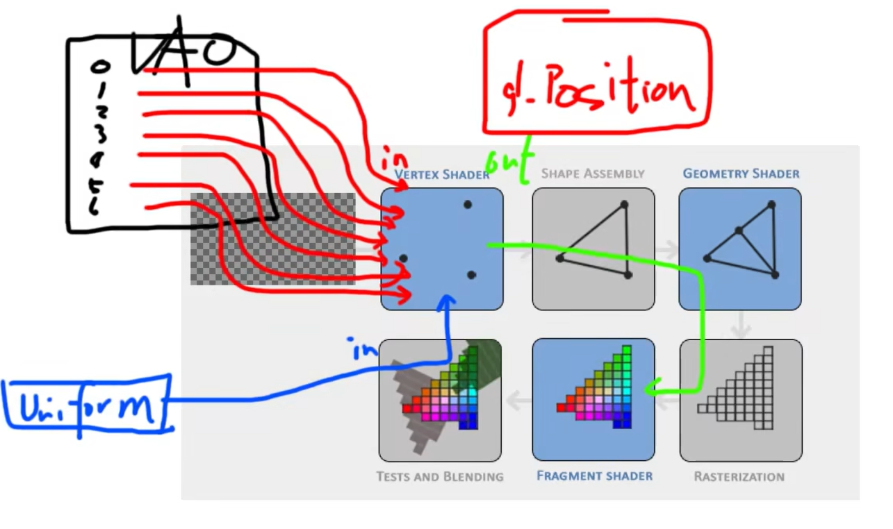
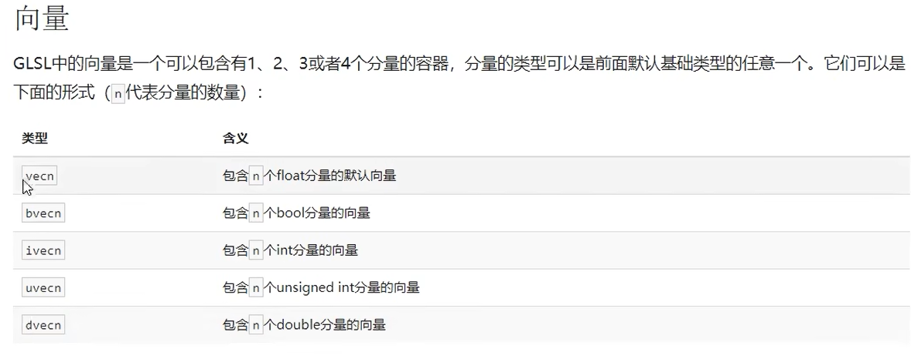
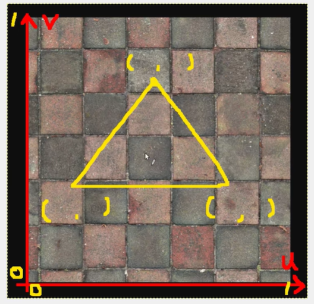

# OpenGL

> Author: Sylvie233
>
> Date: 23/5/12
>
> Point: P22


[TOC]

## 基础介绍

`opengl32.lib`、`glfw3.lib`、`glew32s.lib`、


基础使用

```C+=
#define GLEW_STATIC

#include <GL/glew.h>
#include <GLFW/glfw3.h>

int main() {
	glfwInit()
	glfwWindowHint()
	
	GLFWwindow* window = glfwCreateWindow()
	if (nullptr == window) {
		glfwTerminate()
	}
	
	glfwMakeContextCurrent(window)
	
	glewExperimental = true
	if (GLEW_OK != glewInit()) {
		glfwTerminate()
	}
	
	glViewPort(0, 0, 800, 600)
	
	while (!glfwWindowShouldClose(window)) {
		glfwSwapBuffers(window)
		glfwPollEvents()
	}
	
	glfwTerminate()
	
	return 0;
}
```




VBO、EBO、VAO、VertexShader、FragmentShader、ShaderProgram、

VAO定义了VBO中点数据的意义，EBO提供了VBO中的索引


### GLFW


### GLEW


### GLAD


### GLM


## 核心内容

```
<GL/glew.h>:
	glewExperimental:
	glActiveTexture():
		GL_TEXTURE0:
		GL_TEXTURE1 :
	glAttachShader():
	glBindBuffer(): 绑定VBO
		GL_ARRAY_BUFFER:
		GL_ELEMENT_ARRAY_BUFFER:
    glBindTexture():
	glBindVertexArray(): 绑定VAO
	glBufferData():
		GL_ELEMENT_ARRAY_BUFFER:
	glClear():
		GL_COLOR_BUFFER_BIT:
	glClearColor():
	glCompileShader():
	glCreateProgram():
	glCreateShader():
		GL_VERTEX_SHADER:
	glCullFace():
		GL_BACK:
	glDeleteShader():
	glDrawArrays():
		GL_TRIANGLES:
	glDrawElements():
	glEnable:
		GL_CULL_FACE:
	glEnableVertexAttribArray():
	glewInit():
	glGenerateMipmap():
		GL_TEXTURE_2D:
	glGenBuffers(): 生成VBO点数据
	glGenTextures(): 生成纹理
	glGenVertexArrays(): 生成VAO
	glGetProgramiv():
	glGetProgramInfoLog():
	glGetShaderiv():
	glGetShaderInfoLog():
	glGetUniformLocation(): 从shader程序程序中获取uniform变量
	glLinkProgram():
	glPolygonMode():
		GL_FRONT_AND_BACK:
			GL_LINE:
	glShaderSource():
	glTexImage2D(): 根据纹理设置生成图像
		GL_RGB:
	glTexParameteri(): 设置纹理的环绕、过滤方式
		GL_TEXTURE_2D:
			GL_TEXTURE_WRAP_S:
			GL_TEXTURE_WRAP_T:
				GL_REPEAT:
			GL_TEXTURE_MIN_FILTER:
			GL_TEXTURE_MAG_FILTER:
				GL_LINEAR:
	glUniform4f(): 设置uniform变量的值
	glUseProgram(): 使用ShaderProgram
	glVertexAttribPointer():
	glViewport():
<GLFW/glfw3.h>:
	GLFWindow:
	glfwCreateWindow():
	glfwGetKey():
		GLFW_KEY_ESCAPE:
	glfwGetTime():
	glfwInit():
	glfwMakeContextCurrent():
	glfwPollEvents():
	glfwSetWindowShouldClose():
	glfwSwapBuffers():
	glfwTerminate():
	glfwWindowHint():
		GLFW_CONTEXT_VERSION_MAJOR:
		GLFW_CONTEXT_VERSION_MINOR:
		GLFW_OPENGL_PROFILE:
			GLFW_OPENGL_CORE_PROFILE:
	glfwWindowShouldClose():
	
```


### Shader




#### GLSL

类C语言


向量




#### VertexShader

```
#version 330 core
layout (location = 0) in vec3 aPos;
layout (location = 1) in vec3 aColor;
layout (location = 2) in vec2 aTexCoord;

out vec4 vertexColor;
out vec2 TexCoord;

void main() {
	gl_Position = vec4(aPos, 1.0);
	vertexColor = vec4(0.5, 0.0, 0.0, 1.0);
	TexCoord = aTexCoord;
}
```


layout中的location与glVertexAttribPointer()中第一个参数意义相同（0~15、最多挖16个变量到Shader中）


#### FragmentShader

```
#version 330 core
out vec4 FragColor;

in vec4 vertexColor;
in vec2 TexCoord;

uniform vec4 xxx; # 在OpenGL程序代码中设定这个变量
uniform sampler2D ourTexture;

void main() {
	FragColor = vertexColor;
	FragColor = texture(ourTexture, TexCoord); # 纹理图片取色
}
```


### Texture

uv纹理贴图




纹理环绕方式，`[0, 1]`范围外数据处理

纹理过滤

多级渐远纹理(Mipmap)，OpenGL会使用不同的多级渐远纹理，即最适合物体距离的那个

纹理有16个槽位(默认使用0)，切换槽位使用`glActiveTexture()`，并手动设置shader中uniform变量的值(0~15)


### Coordinate


### Transformation


### Camera


### Material


### Light


